Chương trình windows bằng C#  

Cấu trúc dự án như sau:  

```
Winform_App_Template/                   // Thư mục chứa toàn bộ dự án
│
├── .vscode/                            // Cấu hình debug trong visual studio code
├── Winform_App_Template/
│   ├── Database/
│   │    ├─ Model                       // Chứa các schema dữ liệu trả về
│   │    │  ├── Wallet_Model.cs         // Schema của bảng dữ liệu Wallet trong SQL Server
│   │    │  ...                         // Các Schema của các bảng khác được viết ở đây
│   │    │  └── Users_Login_Model.cs    // Schema của bảng dữ liệu Wallet trong SQL Server  
│   │    │
│   │    ├─ Table                       // Chứa các lệnh truy vấn tương ứng với từng bảng trong SQL Server 
│   │    │  ├── Users_Login_Table.cs    // Các lệnh truy vấn của bảng Users_Login được viết ở đây
│   │    │  ...                         // Các lệnh truy vấn của các bảng còn lại được viết ở đây
│   │    │  └── Wallet_Table.cs         // Các lệnh truy vấn của bảng Wallet_Table được viết ở đây
│   │    │
│   │    ├─ DbConfig.cs                 // Lấy connection string (ENV trước, fallback config)
│   │    ├─ SqlPolicies.cs              // Chính sách Polly: retry + circuit breaker
│   │    ├─ SqlConnectionFactory.cs     // Tạo SqlConnection mở sẵn (async)
│   │    ├─ DbExecutor.cs               // Hàm thực thi (Dapper) có retry, timeout, cancel
│   │    └─ TransientErrorDetector.cs   // Cấu hình các lỗi cho phép retry hoặc mở break
│   │   
│   ├── Form/                           // Chứa các giao diện của chương trình
│   │   ├── Main_Form.cs                // Giao diện chính của chương trình
│   │   └── Main_Form.py
│   │
│   ├── Utils/                          // Các hàm tiện tích sử dụng chung
│   │   ├── Constants.cs                // Các hằng số thiết lập tại đây
│   │   ├── LogEx.cs                    // Custom log từ logging để hiển thị thêm log tại dòng nào và tệp nào
│   │   ├── Shell.cs                    // Truy cập vào hệ thống
│   │   └──Logging.cs                   // Cấu hình logger sử dụng thư viện Serial Log
│   │
│   ├──Directory.Build.props            // Cấu hình thư viện được sử dụng trong dự án
│   ├──Directory.Packages.props         // Quản lý các gói thư viện cài đặt vào
│   ├──packages.lock.json               // Khóa các thư viện để tránh tải nhầm
│   │
│   └── program.cs                      // Tệp chính chạy chương trình
│
├── My_App.sln                          // Tệp solution để dự án tìm được đến với nhau
├── .dockerignore                       // Cấu hình bỏ qua các thư mục, tệp trong docker
├── .env                                // Tệp tin chứa cấu hình các thông số
├── .gitignore                          // Cấu hình bỏ qua các thư mục, tệp tin trong git
├── .gitattributes                      // Đảm bảo Git lưu file với định dạng UTF-8
├── .editorconfig                       // Đặt mặc định nội dung UTF-8 cho toàn dự án
├── Dockerfile                          // Xây dựng các image cho docker
├── docker-compose.yml                  // Cấu hình các thông số khi chạy trên docker
└── README.md
```

# Mục lục

[I. Đóng gói ứng dụng](#i-đóng-gói-ứng-dụng)  

[II. Các phần tử trong giao diện winform](#ii-các-phần-tử-trong-giao-diện-winforms)  
- [1. Các control nhập/xuất chữ (Text)](#1-các-control-nhậpxuất-chữ-text)  
    - [1. Label](#1-Label)  
    - [2. LinkLabel](#2-LinkLabel)  
    - [3. TextBox](#3-TextBox)  
    - [4. MaskedTextBox](#4-MaskedTextBox)  
    - [5. RichTextBox](#5-RichTextBox)
    
- [2. Các control lựa chọn/nhấp](#2-các-control-lựa-chọnnhấp)  
    - [1. Button](#1-button)  
    - [2. Checkbox](#2-checkbox)  
    - [3. RadioButton](#1-radiobutton)  

- [3. Nhóm control số/giá trị](#3-nhóm-control-sốgiá-trị)  
    - [1. NumericUpDown](#1-numericupdown)  
    - [2. TrackBar](#2-trackbar)  
    - [3. DateTimePicker và MonthCalender](#3-datetimepicker-và-monthcalender)  
    - [4. ProgressBar](#4-ProgressBar)  
    
- [4. Nhóm control danh sách và phân cấp](#4-nhóm-control-danh-sách-và-phân-cấp)  
    - [1. ListBox/CheckedListBox](#1-listboxcheckedlistbox)  
    - [2. Combobox](#2-Combobox)  
    - [3. ListView](#3-ListView)  
    - [4. TreeView](#4-TreeView)  
    - [5. DataGridView](#5-DataGridView)  
    
- [5. Nhóm bố cục/điều hướng](#5-Nhóm-bố-cụcđiều-hướng)  
    - [1. GroupBox](#1-GroupBox)  
    - [2. Panel](#2-Panel)  
    - [3. TabControl](#3-TabControl)  
    - [4. SplitContainer](#4-SplitContainer)  
    - [5. TableLayoutPanel & FlowLayoutPanel](#5-tablelayoutpanel--flowlayoutpanel)  
    
- [6. Thanh menu, trạng thái, công cụ và menu chuột phải ](#6thanh-menu-trạng-thái-công-cụ-và-menu-chuột-phải)  
    - [1. MenuStrip](#1-MenuStrip)  
    - [2. StatusStrip](#2-StatusStrip)  
    - [3. ToolStrip / BindingNavigator](#3-toolstrip--bindingnavigator)  
    - [4. ContextMenuStrip](#4-ContextMenuStrip)  
    - [5. Hộp thoại chuẩn (Common Dialogs)](#5-Hộp-thoại-chuẩn-Common-Dialogs)  

- [7. Thành phần không giao diện (Component)](#7-Thành-phần-không-giao-diện-Component)  
    - [1. Timer](#1-Timer)  
    - [2. BackgroundWorker (truyền thống) và Tasks + async/await (khuyến nghị)](#2-backgroundworker-truyền-thống-và-tasks--asyncawait-khuyến-nghị)  
    - [3. ErrorProvider](#3-ErrorProvider)  
    - [4. ToolTip](#4-ToolTip)  
    - [5. NotifyIcon](#5-NotifyIcon)  
    - [6. ImageList](#6-ImageList)  
    - [7. FileSystemWatcher](#7-FileSystemWatcher)  
    - [8. SerialPort](#8-SerialPort)  
    - [9. Process](#9-Process)  
- [8. Hình ảnh đồ họa](#8-hình-ảnh-đồ-họa)  
    - [1. PictureBox](#1-PictureBox)  
    - [2. Vẽ tùy biến (GDI+)](#2-vẽ-tùy-biến-gdi)  
    
- [9. Ràng buộc dữ liệu (Binding)](#9-Ràng-buộc-dữ-liệu-Binding)  
    - [1. BindingSource](#1-BindingSource)  
    - [2. BindingNavigator](#2-BindingNavigator)  
 
[III. Thread, Timer, BackgroundWorker, Task](#iii-Thread-Timer-BackgroundWorker-Task)  
- [1. Thread](#1-Thread)  

- [2. Task](#2-Task)  
    - [1. Await](#1-await)  
    - [2. Task.Run](#2-Taskrun)  

- [3. Timer](#3-Timer)  
    - [1. Timer trong Forms](#1-Timer-trong-forms)  
    - [2. Timer trong Timer](#2-Timer-trong-timer)  
    - [3. Timer trong Threading](#3-Timer-trong-threading)  
    - [4. PeriodicTimer](#4-PeriodicTimer)  
    - [5. BackgroundWorker](#5-backgroundworker)  

[IV. Quản lý vòng đời](#iv-quản-lý-vòng-đời)  
- [1. Sử dụng using (cách được khuyến nghị)](#1-Sử-dụng-using-cách-được-khuyến-nghị)  

[V. Database](#v-Database)  
- [1. SqlClient](#1-Sqlclient)  
- [2. Entity Framework](#2-Entity-framework)  

# I. Đóng gói ứng dụng  

> Đóng gói tất cả thành 1 tệp exe duy nhất  
> Thay đổi tham số `--self-contained` thành `--no-self-contained` để đóng gói nhỏ nhẹ, nhưng thiết bị chạy cần có dotnet  
> Khi đó đầu ra sẽ nằm ở: `bin\Release\net{version}-windows\win-x64\publish\`  

```C#
dotnet publish -c Release -r win-x64 --self-contained true /p:PublishSingleFile=true /p:IncludeNativeLibrariesForSelfExtract=true
```

Hoặc có thể copy cả thư mục `Debug` tại đường dẫn: `bin/Debug/phiên bản dotnet/`. Thư mục này chứa toàn bộ tệp exe và các thư viện đi kèm được copy vào đây khi chạy ở chế độ `Debug`.  

# II. Các phần tử trong giao diện winforms

## 1. Các control nhập/xuất chữ (Text)

### 1. Label

Dùng để hiển thị văn bản tĩnh, mô tả cho input.  

Có thể kéo thả `label` từ `Toolbox` vào form.  

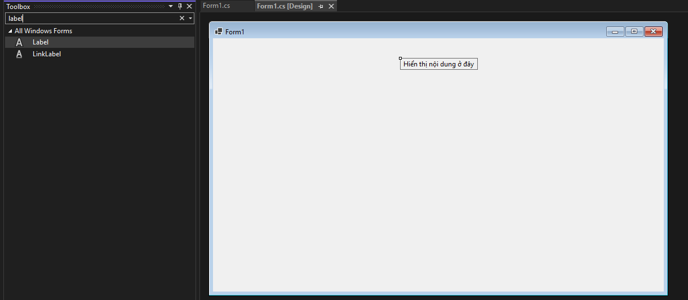  

Hoặc sử dụng code sau:  
```C#
var lbl = new Label {
    Text = "&Họ và tên:",
    AutoSize = true,
    Location = new Point(16, 20)
};
this.Controls.Add(lbl);
```
- Thuộc tính: `Text`, `AutoSize`, `ForeColor`, `BackColor`, `Font`, `TextAlign`.  

Lưu ý: `AutoSize=true` giúp tự giãn theo nội dung; đặt `UseMnemonic=true` & `&` để tạo phím tắt cho control kế tiếp (Alt + ký tự).  

Các thuộc tính chính trong `label`.  

- `Anchor`: Cố định vị trí của nhãn tại 1-2 điểm  

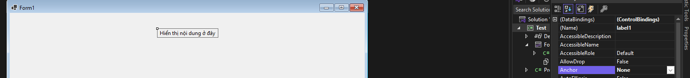  

Sẽ có 4 vị trí để cố định như sau:  
`right`, `left`, `top`, `bottom` là các vị trí cố định nhãn theo phía được chỉ định, khi kéo dãn cửa sổ màn hình thì nó luôn nằm 1 khoảng cách bằng với ban đầu so với phía đã đặt  
Ta có thể đặt nhãn cố định theo 2 phía cùng lúc, 3, 4 phía sẽ không được hỗ trợ. Còn nếu ko chọn phía nào (`None`) thì nó tự động co dãn theo vị trí ban đầu  

- `AutoSize`: Khi nhận giá trị `False` thì cho phép người dùng thay đổi kích thước của nhãn, hoặc khi bật `True` thì nó sẽ tự động co dãn kích thước theo nội dung văn bản trong nó  
- `Text`: Thay đổi nội dung trong label  
- `TextAlign`: Căn chỉnh nội dung văn bản là giữa, trên, dưới, ...  
- `Modifier`: Thuộc tính của nhãn cho phép nó là `Public`, `Private`, `Internal`, ...

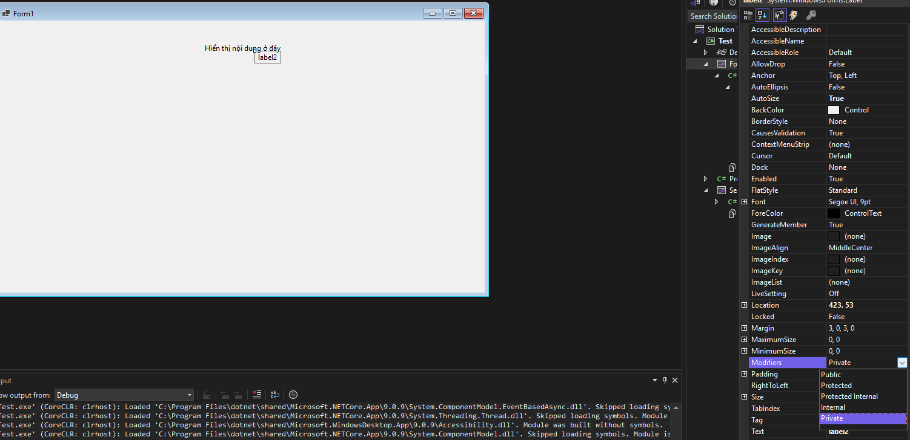  

Mặc định sẽ là `private`, khi chuyển sang `public`, `Internal` thì cho phép chỉnh sửa các thuộc tính của nhãn từ `form` khác.  

### 2. LinkLabel

Dùng để hiển thị liên kết (mở URL, file, form trợ giúp).  

Sử dụng sự kiện: `LinkClicked`.  

```C#
var link = new LinkLabel { Text = "Mở website", AutoSize = true };
link.LinkClicked += (s, e) => System.Diagnostics.Process.Start("https://example.com");
```

### 3. TextBox

Dùng để nhập văn bản một dòng hoặc nhiều dòng.  

- Thuộc tính: `Text`, `Multiline`, `ReadOnly`, `MaxLength`, `PasswordChar`, `CharacterCasing`, `ScrollBars`.  

Sự kiện: `TextChanged`, `KeyDown`, `Validating` (kiểm tra hợp lệ).  

Mẹo: đặt `Anchor/Dock` để tự co giãn theo form; `UseSystemPasswordChar=true` cho mật khẩu.  

```C#
var txt = new TextBox { Width = 240, MaxLength = 100 };
txt.Validating += (s, e) => {
    if (string.IsNullOrWhiteSpace(txt.Text)) { e.Cancel = true; errorProvider1.SetError(txt, "Không được để trống"); }
    else errorProvider1.SetError(txt, "");
};
```

### 4. MaskedTextBox

Dùng để nhập theo mặt nạ (điện thoại, CMND, ngày).  
- Thuộc tính: `Mask` (VD "0000-0000"), `PromptChar`, `TextMaskFormat`.  

```C#
var msk = new MaskedTextBox { Mask = "00/00/0000" }; // dd/MM/yyyy
```

### 5. RichTextBox

Dùng để nhập văn bản định dạng (đậm/ nghiêng/ màu/ danh sách…).  

- Tính năng: load/save RTF, tìm/đổi màu chữ được chọn.  

```C#
richTextBox1.SelectedText = "Xin chào";
richTextBox1.SelectionFont = new Font("Segoe UI", 10, FontStyle.Bold);
```

## 2. Các control lựa chọn/nhấp

### 1. Button

Dùng để kích hoạt hành động.  

- Thuộc tính: `Text`, `Image`, `TextImageRelation`, `DialogResult`.  
Sự kiện: `Click`.  

Mẹo: gán `AcceptButton`/`CancelButton` cho Form để `Enter/Esc` hoạt động.  

```C#
var btn = new Button { Text = "Lưu (Ctrl+S)" };
btn.Click += (s, e) => SaveData();
```
### 2. CheckBox

Dùng để `bật/tắt (true/false)`; có thể 3 trạng thái (`ThreeState=true`).  
Sự kiện: `CheckedChanged`.  

### 3. RadioButton

Dùng để chọn một trong nhiều tùy chọn (cần cùng `GroupBox/Panel`)  
Sự kiện: `CheckedChanged`  
```C#
if (radMale.Checked) gender = "M"; else if (radFemale.Checked) gender = "F";
```

## 3. Nhóm control số/giá trị

### 1. NumericUpDown

Dùng để nhập số có tăng/giảm bằng mũi tên.  
Thuộc tính: `Minimum`, `Maximum`, `DecimalPlaces`, `Increment`, `Value`, `interceptArrowKeys`.  
```C#
numQty.Minimum = 1; numQty.Maximum = 1000; numQty.Value = 10; numQty.Increment = 5;
```
### 2. TrackBar

Dùng để điều chỉnh giá trị bằng thanh trượt (Âm lượng/Độ sáng, ....)  
Sự kiện: `Scroll`, `ValueChanged`  

### 3. DateTimePicker và MonthCalender

Dùng để chọn ngày/giờ.  
Thuộc tính: `Format (Short, Long, Custom)`, `CustomFormat`.  
```C#
dtp.CustomFormat = "dd/MM/yyyy HH:mm tt"; dtp.Format = DateTimePickerFormat.Custom;
```

Để thay cho popup hiển thị lên chọn ngày tháng năm bằng các mũi tên thì ta sử dụng thuộc tính `ShowUpDown`.  
```C#
dtp.ShowUpDown = True;
```

### 4. ProgressBar

Hiển thị thanh tiến trình  
Để kich hoạt từng `step` của thanh tiến trình thì ta gọi lệnh: `PerformStep` hoặc `PerformLayout`.  

Đối với `progressBar` có thuộc tính `Style`: `Block` hoặc `Continuous` thì sử dụng `PerformStep` tăng giá trị cho `ProgressBar` theo từng giá trị `step`.  
Đối với `ProgressBar` có thuộc tính `Style`: `Marquee` thì sử dụng `PerfornLayout`.  

Ví dụ ta tăng giá trị của `progressBar1` bằng hàm Timer định kỳ để nhận thấy thay đổi.  
```C#
private void Timer1_Tick(object? sender, EventArgs e)
{
    progressBar1.PerformStep();
    label1.Text = progressBar1.Value.ToString();
}

private void button1_Click(object sender, EventArgs e)
{
    timer1.Enabled = !timer1.Enabled;
}
```
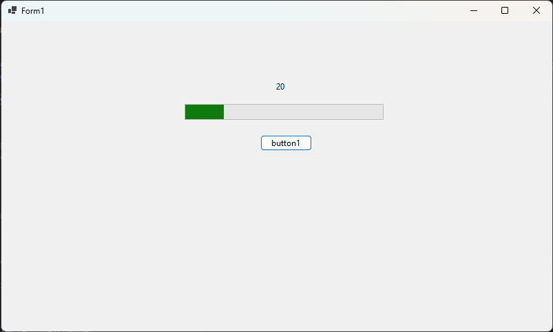  

## 4. Nhóm control danh sách và phân cấp

### 1. ListBox/CheckedListBox

Dùng để hiển thị danh sách đơn giản; `CheckedListBox` có `tick`.  
Thuộc tính: `DataSource`, `DisplayMember`, `ValueMember`, `SelectionMode`.  
Sự kiện: `SelectedIndexChanged`.
```C#
listBox1.DataSource = products;  // IEnumerable
listBox1.DisplayMember = "Name";
listBox1.ValueMember = "Id";
```
### 2.Combobox

Dùng để chọn 1 mục từ danh sách, có thể gõ (`DropDown`) hoặc không (`DropDownList`).  
Sự kiện: `SelectedIndexChanged`, `DropDown`, `TextUpdate`.  
```C#
combo.DropDownStyle = ComboBoxStyle.DropDownList;
combo.DataSource = departments;
combo.DisplayMember = "Name"; combo.ValueMember = "Code";
```
### 3. ListView

Dùng để danh sách nhiều cột (`Details`), biểu tượng (`LargeIcon/SmallIcon`), nhóm.  
Thuộc tính: `View=Details`, `FullRowSelect=true`, `GridLines=true`, `Columns`.  
Tính năng: `VirtualMode` cho dữ liệu lớn.  
```C#
listView1.View = View.Details;
listView1.Columns.Add("Mã", 80);
listView1.Columns.Add("Tên", 200);
listView1.Items.Add(new ListViewItem(new[] {"P01","Phòng Kế toán"}));
```
### 4 TreeView

Dùng để dữ liệu phân cấp (thư mục, menu, danh mục).  
Sự kiện: `AfterSelect`, `NodeMouseClick`.  
```C#
var root = treeView1.Nodes.Add("Phòng ban");
root.Nodes.Add("Kế toán"); root.Nodes.Add("Kỹ thuật");
```

### 5. DataGridView

Dùng để tạo bảng dữ liệu mạnh mẽ: `binding`, `chỉnh sửa`, `sắp xếp`, `template cột`.  
Thuộc tính: `DataSource`, `AutoGenerateColumns`, `AllowUserToAddRows`, `EditMode`, `SelectionMode`, `AutoSizeColumnsMode`.  
Cột: `DataGridViewTextBoxColumn`, `ComboBoxColumn`, `CheckBoxColumn`, `ButtonColumn`, `ImageColumn`.  
Sự kiện: `CellFormatting`, `CellValidating`, `CellEndEdit`, `RowValidating`, `DataError`.  

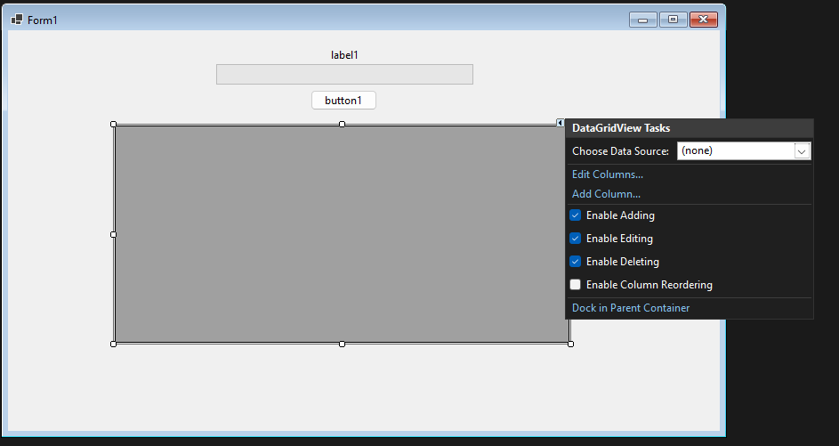  

> Mẹo: dùng BindingSource để filter/sort;  
> Bật `VirtualMode` cho dữ liệu lớn: tự cung cấp dữ liệu theo chỉ số hàng khi dữ liệu rất lớn.    
> Tắt `AutoSize` khi nạp dữ liệu, sau đó bật `AutoSize`: Tránh tính toán lại nhiều lần  
> Phân trang (paging): tải theo trang thay vì tất cả.  
> `AutoGenerateColumns=false`: bạn chủ động định nghĩa cột.  
> Bọc `DataError` để không văng `exception` ra UI.  


Ví dụ cấu hình cho một `DataGridView` có 2 cột `Họ tên` và `Lương`:  
```C#
private void SetupGrid()
{
    dataGridView1.AutoGenerateColumns = false;
    dataGridView1.SelectionMode = DataGridViewSelectionMode.FullRowSelect;
    dataGridView1.AllowUserToAddRows = false;

    dataGridView1.Columns.Add(new DataGridViewTextBoxColumn {
        DataPropertyName = "Name",
        HeaderText = "Họ tên",
        AutoSizeMode = DataGridViewAutoSizeColumnMode.Fill
    });

    dataGridView1.Columns.Add(new DataGridViewTextBoxColumn {
        DataPropertyName = "Salary",
        HeaderText = "Lương",
        DefaultCellStyle = { Format = "N0" } // format hiển thị ngay trong lưới
    });

    // Xử lý lỗi ràng buộc dữ liệu (nếu có) để không crash UI
    dataGridView1.DataError += (s, e) =>
    {
        // e.Exception chứa chi tiết — nên log lại
        e.ThrowException = false; // nuốt lỗi để người dùng tiếp tục thao tác
    };

    // Cấu hình header nằm giữa
    dataGridView1.ColumnHeaderDefaultCellStyle.Alignment = DataGridViewContentAlibnment.MiddleCenter;
}
```

`Validation` trong lưới:  
```#
private void dataGridView1_CellValidating(object sender, DataGridViewCellValidatingEventArgs e)
{
    // Ví dụ: cột "Name" không được rỗng
    if (dataGridView1.Columns[e.ColumnIndex].DataPropertyName == "Name")
    {
        string newVal = Convert.ToString(e.FormattedValue);
        if (string.IsNullOrWhiteSpace(newVal))
        {
            e.Cancel = true; // hủy commit
            dataGridView1.Rows[e.RowIndex].ErrorText = "Tên không được trống";
        }
        else
        {
            dataGridView1.Rows[e.RowIndex].ErrorText = null;
        }
    }
}
```

Cột đặc biệt (Button, ComboBox) và bắt sự kiện click  
```C#
// Thêm cột Button “Xem”
var colBtn = new DataGridViewButtonColumn
{
    Text = "Xem",
    UseColumnTextForButtonValue = true,
    HeaderText = ""
};
dataGridView1.Columns.Add(colBtn);

// Bắt click nút trong ô
dataGridView1.CellContentClick += (s, e) =>
{
    if (e.RowIndex >= 0 && dataGridView1.Columns[e.ColumnIndex] is DataGridViewButtonColumn)
    {
        var emp = (Employee)((BindingSource)dataGridView1.DataSource)[e.RowIndex];
        MessageBox.Show($"Chi tiết: {emp.Name} - {emp.Salary:N0}");
    }
};
```
Tối ưu hóa hiển thị và tắt autosize mỗi khi nạp dữ liệu:  
```C#
// Bật double-buffer (qua kế thừa là tốt nhất; dưới đây dùng reflection nhanh)
typeof(DataGridView).InvokeMember("DoubleBuffered",
    System.Reflection.BindingFlags.NonPublic | System.Reflection.BindingFlags.Instance | System.Reflection.BindingFlags.SetProperty,
    null, dataGridView1, new object[] { true });

// Khi nạp dữ liệu lớn:
dataGridView1.AutoSizeColumnsMode = DataGridViewAutoSizeColumnsMode.None; // tắt tạm
// ... bind dữ liệu ...
dataGridView1.AutoSizeColumnsMode = DataGridViewAutoSizeColumnsMode.DisplayedCells; // bật sau
```

`VirtualMode` cho dữ liệu rất lớn:  
```C#
// Giả lập cache dữ liệu lớn
private string[][] _cache;

private void InitVirtualGrid()
{
    // Chuẩn bị cache 100k x 3 (demo; thực tế nên lazy-load)
    _cache = new string[100_000][];
    for (int r = 0; r < _cache.Length; r++)
        _cache[r] = new[] { $"Mã-{r:D6}", $"Tên {r}", (r * 10_000m).ToString("N0") };

    dataGridView1.VirtualMode = true;           // Bật virtual
    dataGridView1.RowCount = _cache.Length;     // Cho grid biết tổng số hàng

    dataGridView1.Columns.Clear();
    dataGridView1.Columns.Add("Code", "Mã");
    dataGridView1.Columns.Add("Name", "Tên");
    dataGridView1.Columns.Add("Salary", "Lương");

    // Cấp dữ liệu cho ô theo yêu cầu
    dataGridView1.CellValueNeeded += (s, e) =>
    {
        e.Value = _cache[e.RowIndex][e.ColumnIndex]; // Trả về dữ liệu từ cache
    };
}
```


## 5. Nhóm bố cục/điều hướng
### 1. GroupBox

Dùng để nhóm các control có liên quan; có nhãn.  
```C#
var grp = new GroupBox { Text = "Thông tin cơ bản", Dock = DockStyle.Top, Height = 140 };
```
### 2. Panel
Dùng để: vùng chứa đơn giản; kết hợp `AutoScroll` để cuộn.  
```C#
panel1.AutoScroll = true;
```

### 3. TabControl
Dùng để phân trang nội dung (Tab).  
```C#
tabControl1.TabPages.Add("Cấu hình", "Cấu hình");
```
### 4. SplitContainer

Dùng để chia vùng `trái/phải` hoặc `trên/dưới` có thanh kéo thay đổi kích cỡ.  
```C#
splitContainer1.Panel1.Controls.Add(treeView1);
splitContainer1.Panel2.Controls.Add(dataGridView1);
```

### 5. TableLayoutPanel & FlowLayoutPanel

Dùng để bố cục lưới (Table) hoặc dòng chảy (Flow) — cực hữu ích cho UI responsive theo resize.
```C#
tableLayoutPanel1.ColumnStyles.Add(new ColumnStyle(SizeType.Absolute, 120));
tableLayoutPanel1.ColumnStyles.Add(new ColumnStyle(SizeType.Percent, 100));
```

## 6. Thanh menu, trạng thái, công cụ và menu chuột phải

### 1. MenuStrip

Dùng để menu trên cùng `(File, Edit…)`.  
Có thể thêm hình ảnh vào trước các lựa chọn bằng thuộc tính `Image`.  

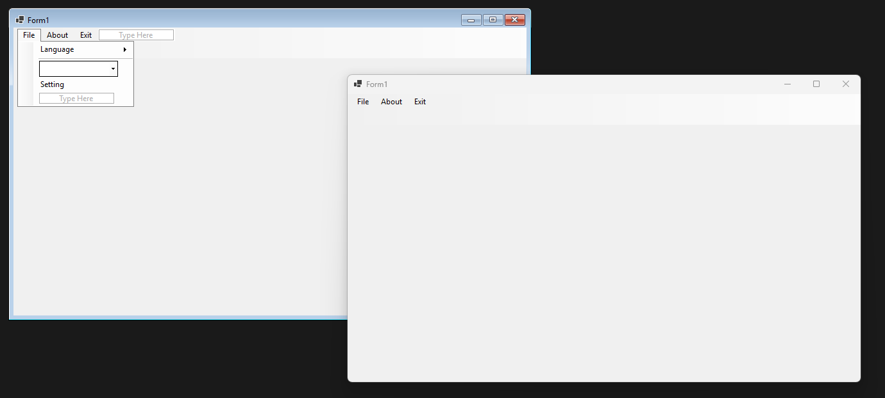  

Mẹo: gắn `ShortcutKeys` cho `ToolStripMenuItem`.  
```C#
var miSave = new ToolStripMenuItem("&Save"){ ShortcutKeys = Keys.Control | Keys.S };
miSave.Click += (s,e) => SaveData();
menuStrip1.Items.Add(new ToolStripMenuItem("&File", null, miSave));

void SaveData()
{
    MessageBox.Show("Sử dụng phím tắt");
}
```

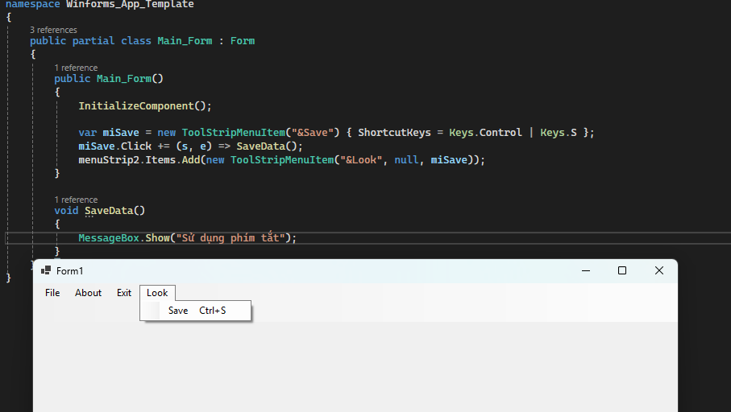  

Ta gắn phím tắt `Ctr+S` cho menu `Look` ở `MenuStrip`. Khi ấn phím tắt thì nó sẽ hiển thị thông báo.  

### 2. StatusStrip

Dùng để: trạng thái dưới cùng (text, progress, thông tin người dùng).
```C#
// Kéo thả từ giao diện hoặc sử dụng code
var status_bar_item = new ToolStripLabel(Text = "Xin chào, đây là tôi");
statusStrip1.Items.Add(status_bar_item);
```

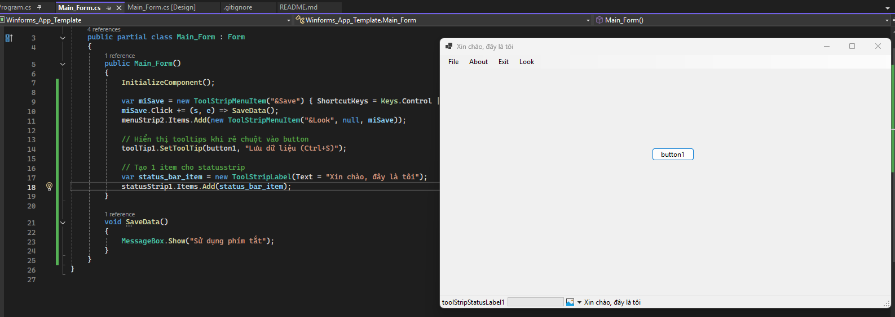  

### 3. ToolStrip / BindingNavigator

Dùng để thanh công cụ (icon + tooltip); `BindingNavigator` là `ToolStrip` chuyên cho thao tác dữ liệu `(First/Prev/Next/Last/Add/Delete)`.  

```C#
toolStrip1.Items.Add(new ToolStripButton("Làm mới", null, (s,e)=>Reload()));
```

### 4. ContextMenuStrip

Dùng để menu khi chuột phải cho `control`.  

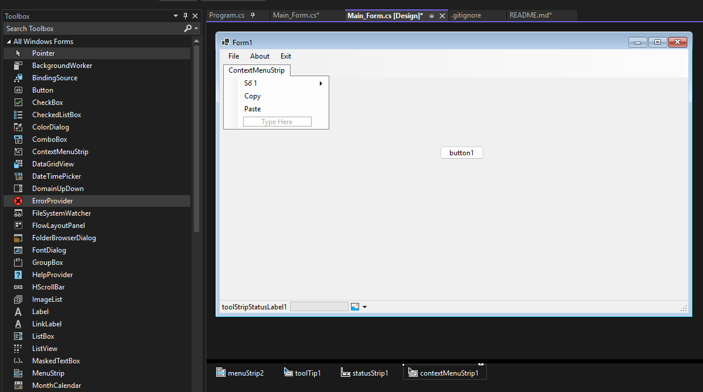  

Ta có thể kéo thả và tạo các menu cho `ContextMenuStrip` từ giao diện.  
Sau đó gán `ContextMenuStrip` này cho một control bất kỳ thông qua thuộc tính `ContextMenuStrip`.  

```C#
button1.ContextMenuStrip = contextMenuStrip1;
```

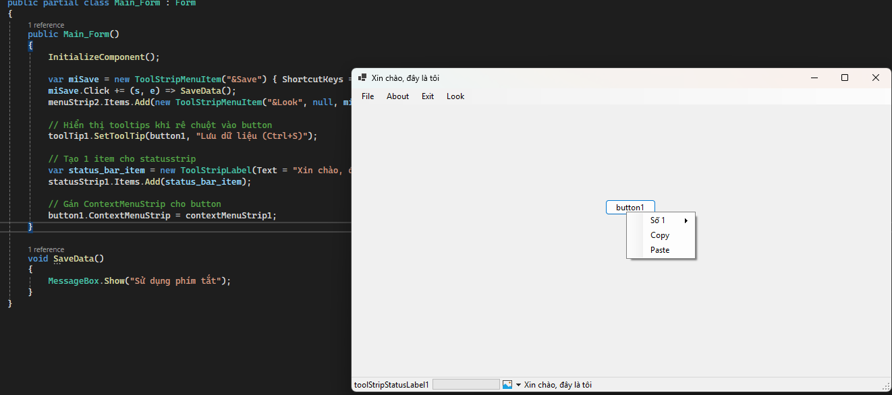  

Hoặc tạo 1 `ContextMenuStrip` từ code như sau:  
```C#
// Tạo 1 contextmenustrip
ContextMenuStrip contextMenuStrip1111;
contextMenuStrip1111 = new ContextMenuStrip();

// Thêm các button vào contextmenustrip
var button_context_menu1 = new ToolStripButton(Text = "Click me");
// Thêm sự kiện cho việc click button
button_context_menu1.Click += Button_context_menu1_Click;

// Gắn vào contextmenustrip
contextMenuStrip1111.Items.Add(button_context_menu1);
```

```C#
// Tạo sự kiện cho button
private void Button_context_menu1_Click(object? sender, EventArgs e)
{
    MessageBox.Show((sender as ToolStripItem).Text);
}
```

Khi đó ta `click chuột phải` vào control thì nó sẽ hiển thị nội dung cho ta.  
Một cách khác để hiển thị `ContextMenuStrip` bằng hàm `Show()` như sau:  
Ta bắt sự kiện `click`, `keypress`, ... rồi gọi hàm `show` của `ContextMenuStrip`.  
Hàm `Show` của `ContextMenuStrip` có 6 phương thức `overload`, ta thường sử dụng phương thức `1 và 2`. Ví dụ với phương thức thứ 2 sẽ hiển thị `ContextMenuStrip` tại 1 vị trí tương đối so với một `control`.  

  

Tham số đầu tiên là control mà ta chỉ định: `this`: Chính là form (class) chứa nội dung, còn `button2`: là vị trí tương đối so với `button2` này, `MousePosition` là vị trí ngay tại con trỏ chuột  
Tham số thứ hai là`position`: tọa độ tương đối tính từ `control` đã chỉ định.  
Ta có thể kết hợp vừa `this` và vừa `MousePositin`:  
```C#
contextMenuStrip1.Show(this, this.PointToClient(MousePosition);
```
Câu lệnh này sẽ lấy vị trí của chuột trong `Form (this)`  

```C#
// Gán sự kiện click vào button 2
button2.Click += (s, e) =>
{
    contextMenuStrip1.Show(button2, new Point(50,50));

    // Hoặc lấy contextMenu đã được gán cho button1 ở phía trên hiển thị ra
    // button1.ContextMenuStrip.Show(button2, new Point(50,50));
};
```

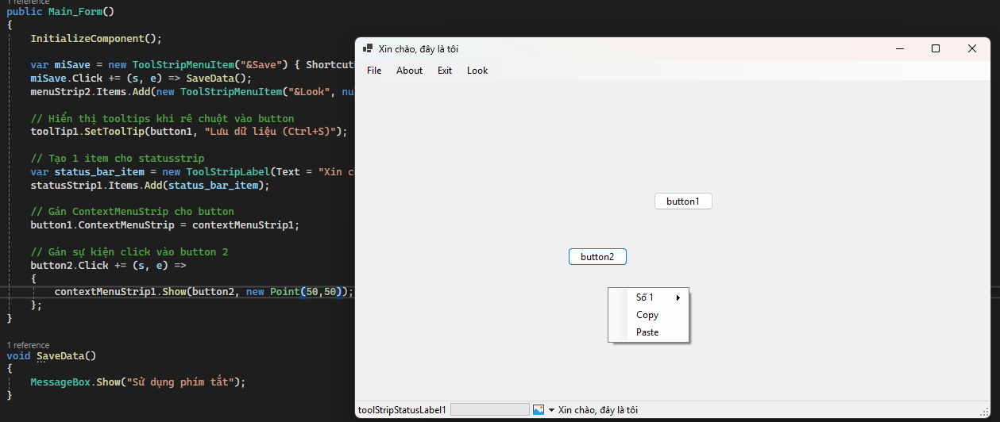  


### 5. Hộp thoại chuẩn (Common Dialogs)

`OpenFileDialog`, `SaveFileDialog`, `FolderBrowserDialog`, `ColorDialog`, `FontDialog`, `PrintDialog`, `PageSetupDialog`, `PrintPreviewDialog`.  
Cách dùng chung: gọi `ShowDialog()`, kiểm tra `DialogResult.OK`.  
```C#
using var dlg = new OpenFileDialog { Filter = "Ảnh|*.png;*.jpg|Tất cả|*.*" };
if (dlg.ShowDialog() == DialogResult.OK) pictureBox1.Image = Image.FromFile(dlg.FileName);
```

## 7. Thành phần không giao diện (Component)

### 1. Timer

Dùng để chạy tác vụ định kỳ trên UI thread (đồng bộ với control).  
Thuộc tính: `Interval` (ms), `Enabled`.
Sự kiện: `Tick`.  
```C#
timer1.Interval = 1000; // 1s
timer1.Tick += (s, e) => lblClock.Text = DateTime.Now.ToString("HH:mm:ss");
timer1.Start();
```
### 2. BackgroundWorker (truyền thống) và Tasks + async/await (khuyến nghị)

`BackgroundWorker`là một lớp cung cấp trong .NET Framework, được thiết kế để thực hiện các tác vụ tốn thời gian trên một luồng nền riêng biệt, thay vì luồng chính (UI thread) của ứng dụng.  
Điều này giúp ngăn chặn ứng dụng bị "đơ" (freeze) và giữ cho giao diện người dùng luôn phản hồi, đặc biệt là trong các ứng dụng Windows Forms hoặc WPF.  
`BackgroundWorker` hoạt động dựa trên mô hình xử lý sự kiện, với các sự kiện được xây dựng sẵn như `DoWork`, `ProgressChanged`, và `RunWorkerCompleted` để đơn giản hóa việc quản lý luồng.  

  - BackgroundWorker:  
    - `DoWork`: Đây là nơi đặt mã để thực hiện công việc ở chế độ nền. Sự kiện này được kích hoạt khi `RunWorkerAsync()` được gọi.  
    - `ProgressChanged`: Kích hoạt khi gọi `ReportProgress()` trong sự kiện `DoWork` để báo cáo tiến độ của công việc đang chạy. Điều này `cho phép cập nhật giao diện người dùng`, như hiển thị thanh tiến trình.  
    - `RunWorkerCompleted`: Sự kiện này được kích hoạt khi công việc ở chế độ nền đã hoàn thành. Nó được sử dụng để thực hiện các hành động cuối cùng, chẳng hạn như hiển thị kết quả.   

```C#
backgroundWorker1.WorkerReportsProgress = true;
backgroundWorker1.DoWork += (s,e)=> { for (int i=0;i<=100;i++){ Thread.Sleep(20); backgroundWorker1.ReportProgress(i);} };
backgroundWorker1.ProgressChanged += (s,e)=> progressBar1.Value = e.ProgressPercentage;
backgroundWorker1.RunWorkerCompleted += (s,e)=> MessageBox.Show("Xong!");
backgroundWorker1.RunWorkerAsync();
```

- `Tasks` (khuyên dùng):  

`Task` là đại diện cho một công việc bất đồng bộ (`Asynchronous operation`).  

- Dùng `Task.Run` để chạy công việc `CPU-bound (tính toán nặng)` trên `thread-pool`, `tránh chặn UI`.  
- Nếu công việc là `I/O-bound` và `thư viện có API bất đồng bộ` (ví dụ đọc/ghi file async, network async), ưu tiên dùng API async/await sẵn có (không dùng Task.Run), vì hiệu quả tài nguyên tốt hơn.  
- Tránh gọi `.Result` hoặc `.Wait()` trên Task trong UI code — sẽ `deadlock` hoặc làm `treo UI`.  

Ta khai báo 1 sự kiện sử dụng bất đồng bộ bằng từ khóa `async void` hoặc `async task`.  
- Dùng `async void` chỉ trong 2 trường hợp:  
    - `Event handler` của WinForms (ví dụ: `button.Click`, `Form.Shown`, `Timer.Tick`…), vì chữ ký event do WinForms định nghĩa là void.  
    - Fire-and-forget có chủ ý (rất hạn chế), khi bạn không cần gọi chờ/ghép (await/WhenAll) ở chỗ gọi. Lúc này phải tự bao try/catch để không làm sập app nếu có exception.  
- `async Task` (hoặc `async Task<T>`) dùng trong các phương thức bất đồng bộ thông thường, giúp `await` được và `bắt lỗi` dễ dàng:  
    - Cho phép await ở chỗ gọi → dễ ghép chuỗi, viết logic tuần tự.  
    - Exception được “gói” trong Task → bắt bằng try/catch ở chỗ gọi (an toàn hơn async void).  
    - Hỗ trợ huỷ (CancellationToken) và test (unit test async).  
    - Dễ composition (móc nối Task.WhenAll/WhenAny, retry, timeout…).  


Luôn bọc `await` trong `try/catch` để xử lý các ngoại lệ xảy ra trong quá trình thực thi. Và có thể dùng `CancellationToken` để hủy các tác vụ bất đồng bộ bất cứ lúc nào.  
Nếu bạn không cần tiếp tục trên `UI thread` sau `await`, có thể dùng `.ConfigureAwait(false)` trong library để giảm `overhead` (không cần trong event handler vì bạn muốn quay lại UI).  

```C#
// Giả sử trên Form có: a) Button btnLoad, b) ListBox lstData, c) Label lblStatus
// Suppose the Form has: a) Button btnLoad, b) ListBox lstData, c) Label lblStatus

using System;
using System.Collections.Generic;
using System.Net.Http;
using System.Threading;
using System.Threading.Tasks;
using System.Windows.Forms;

public partial class MainForm : Form
{
    private readonly HttpClient _http = new HttpClient();  // Tái sử dụng HttpClient / Reuse HttpClient
    private CancellationTokenSource _loadCts;               // Giữ CTS để huỷ / Keep CTS to cancel

    public MainForm()
    {
        InitializeComponent();                              // Khởi tạo UI / Initialize UI
        btnLoad.Click += BtnLoad_Click;                    // Gắn event handler / Attach event handler
    }

    // ① Event handler: buộc là void theo WinForms -> dùng async void
    private async void BtnLoad_Click(object sender, EventArgs e)
    {
        // Nếu đang chạy lần trước thì huỷ / Cancel previous run if any
        _loadCts?.Cancel();                                 // Báo huỷ / request cancellation
        _loadCts = new CancellationTokenSource();           // CTS mới / new CTS
        var token = _loadCts.Token;                         // Lấy token / get token

        btnLoad.Enabled = false;                            // Khoá nút / disable button
        lblStatus.Text = "Đang tải… (Loading…)";            // Báo trạng thái / show status
        lstData.Items.Clear();                              // Xoá dữ liệu cũ / clear old data

        // IProgress<int> tự marshal về UI thread trong WinForms / marshals back to UI thread
        var progress = new Progress<int>(p => lblStatus.Text = $"Đang tải… {p}%");

        try
        {
            // Gọi sang hàm async Task “thực thụ” / call the real async Task worker
            var lines = await DownloadLinesAsync(
                "https://example.com/data.txt",             // URL giả định / demo URL
                progress,                                   // Báo tiến trình / progress
                token                                       // Huỷ / cancellation
            ); // Không dùng ConfigureAwait(false) để tiếp tục trên UI / keep UI context

            foreach (var line in lines)                     // Cập nhật UI sau await / update UI after await
                lstData.Items.Add(line);

            lblStatus.Text = $"Xong: {lines.Count} dòng (Done)"; // Hoàn tất / done
        }
        catch (OperationCanceledException)
        {
            lblStatus.Text = "Đã huỷ (Canceled)";           // Bị huỷ hợp lệ / expected cancel
        }
        catch (Exception ex)
        {
            // Quan trọng với async void: bắt lỗi TẠI ĐÂY, kẻo văng ra đè sập app
            // Important for async void: catch here to avoid app crash
            MessageBox.Show(this, ex.Message, "Lỗi / Error",
                MessageBoxButtons.OK, MessageBoxIcon.Error);
        }
        finally
        {
            if (!IsDisposed)                                // Form chưa bị dispose / ensure form alive
                btnLoad.Enabled = true;                     // Mở lại nút / re-enable button
        }
    }

    // ② Worker “đúng nghĩa” trả về Task<List<string>>
    // ② Real worker that returns Task<List<string>>
    private async Task<List<string>> DownloadLinesAsync(
        string url,
        IProgress<int> progress,
        CancellationToken ct)
    {
        // I/O-bound: await HttpClient (KHÔNG cần Task.Run) / I/O-bound: no Task.Run
        using var resp = await _http.GetAsync(url, HttpCompletionOption.ResponseHeadersRead, ct);
        resp.EnsureSuccessStatusCode();                     // Ném lỗi HTTP != 2xx / throw if not success

        var content = await resp.Content.ReadAsStringAsync(ct); // Đọc chuỗi / read string
        var lines = new List<string>(content.Split(new[] { '\r', '\n' }, StringSplitOptions.RemoveEmptyEntries));

        // Demo báo tiến độ: 0 -> 100 / report some fake progress
        for (int p = 0; p <= 100; p += 20)
        {
            ct.ThrowIfCancellationRequested();              // Tôn trọng huỷ / honor cancellation
            await Task.Delay(50, ct);                       // Mô phỏng / simulate work
            progress?.Report(p);                            // Báo lên UI / report to UI
        }

        return lines;                                       // Trả về kết quả / return result
    }
}
```

### 3.ErrorProvider

Dùng để hiển thị lỗi bên cạnh control khi `validate`.  
```
if (string.IsNullOrWhiteSpace(txtName.Text))
    errorProvider1.SetError(txtName, "Tên không được để trống");
else
    errorProvider1.SetError(txtName, "");
```

### 4.ToolTip

Dùng để hiển thị gợi ý ngắn khi rê chuột vào 1 đối tượng.  
```C#
// Tạo tooltip bằng code hoặc kéo thả từ giao diện
// ToolTip toolTip1 = new ToolTip()

// Hiển thị tooltips khi rê chuột vào button1 
toolTip1.SetToolTip(button1, "Lưu dữ liệu (Ctrl+S)");
```

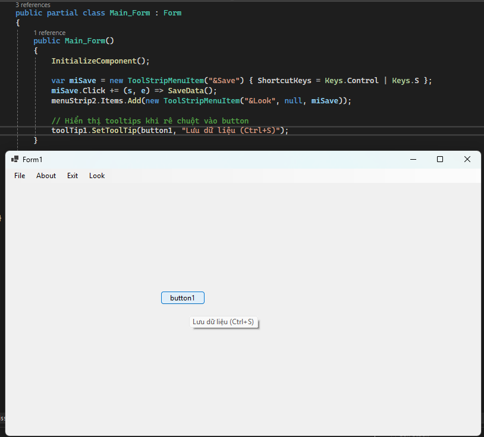  

### 5. NotifyIcon

Dùng để biểu tượng ở khay hệ thống `(system tray)`, hiển thị `balloon`, `menu`, `ẩn/hiện` form.  
```C#
// Phải cài đặt Icon thì mới hiển thị được
notifyIcon1.Icon = this.Icon;
notifyIcon1.Visible = true;

// Popup hiển thị thông báo 
notifyIcon1.BalloonTipTitle = "Ứng dụng chạy nền";
// Hiển thị thông báo trong 3s
notifyIcon1.ShowBalloonTip(3000);

// Hoặc tạo thông báo cụ thể hơn với thời gian hiển thị 5s, title và nội dung lấy từ Textbox1, icon là warning
NotifyIcon1.ShowBallonTip(5000, "Thông báo từ App", TexBox1.Text, ToolTipIcon.Warning)
```

### 6. ImageList

Dùng để kho ảnh nhỏ dùng chung cho `ListView`, `TreeView`, `ToolStrip`.  
```C#
listView1.SmallImageList = imageList1; // imageList1.Images.Add("ok", icon16px);
```

### 7. FileSystemWatcher

Dùng để theo dõi thay đổi thư mục/tệp `(tạo/sửa/xóa/đổi tên)`.  
```C#
fileSystemWatcher1.Path = @"D:\Shared";
fileSystemWatcher1.Created += (s,e)=> AppendLog($"New file: {e.FullPath}");
fileSystemWatcher1.EnableRaisingEvents = true;
```

### 8. SerialPort

Dùng để giao tiếp COM (thiết bị cân, máy quét…).  
```C#
serialPort1.PortName = "COM3"; serialPort1.BaudRate = 9600; serialPort1.Open();
serialPort1.DataReceived += (s, e) => { var data = serialPort1.ReadExisting(); BeginInvoke(()=> txtLog.AppendText(data)); };
```

### 9. Process

Dùng để chạy tiến trình ngoài (cmd, ffmpeg…).  
```C#
// Khởi động chương trình notepad
Process.Start(new ProcessStartInfo { FileName = "notepad.exe", UseShellExecute = true });

// Khởi động 1 chương trình khác qua đường dẫn
Process.Start(Application.StartupPath + "\\update.exe")

// Mở 1 trang web
Process.Start(@"http:\\google.com")
```
## 8. Hình ảnh đồ họa

### 1. PictureBox

Dùng để hiển thị ảnh, `SizeMode` (`StretchImage`, `Zoom`…).  
```C#
pictureBox1.SizeMode = PictureBoxSizeMode.Zoom;
pictureBox1.Image = Image.FromFile("logo.png");
```

### 2. Vẽ tùy biến (GDI+)

`Override` `OnPaint` hoặc `handle Paint` để vẽ (`line`, `text`, `anti-alias`).  
```C#
protected override void OnPaint(PaintEventArgs e) {
    e.Graphics.SmoothingMode = System.Drawing.Drawing2D.SmoothingMode.AntiAlias;
    e.Graphics.DrawEllipse(Pens.Gray, 10, 10, 100, 100);
    base.OnPaint(e);
}
```

## 9. Ràng buộc dữ liệu (Binding)

Là kỹ thuật kết nối dữ liệu, giúp đồng bộ hóa dữ liệu giữa nguồn dữ liệu (data source) và giao diện người dùng (UI) một cách tự động.  
Điều này có nghĩa là khi dữ liệu thay đổi, UI sẽ tự động cập nhật, và ngược lại, các thay đổi trên UI cũng có thể được cập nhật vào dữ liệu nguồn.  

- Đừng bind trực tiếp `List` vào nhiều control. Hãy dùng `BindingSource` ở giữa:  
    - Cho phép điều hướng (vị trí hiện tại), thông báo thay đổi, (hạn chế) filter/sort.  
- Model nên kế thừa `INotifyPropertyChanged` để UI tự cập nhật khi giá trị thay đổi.  
- `Validate` qua `IDataErrorInfo/INotifyDataErrorInfo` + `ErrorProvider`  

### 1. BindingSource

Quy tắc luôn `bind control` qua `BindingSource`:  
```C#
BindingSource bs = new BindingSource();
bs.DataSource = new BindingList<Employee>(LoadEmployees());
dataGridView1.DataSource = bs;

// Control đơn lẻ. DataSourceUpdateMode.OnPropertyChanged → cập nhật ngay khi Text thay đổi.
txtName.DataBindings.Add("Text", bs, "Name", true, DataSourceUpdateMode.OnPropertyChanged);
```

Ví dụ khi `BindingSource` vào `Model` có thông báo lỗi:  

```C#
using System;
using System.ComponentModel;
using System.Windows.Forms;

public class Employee : INotifyPropertyChanged, IDataErrorInfo
{
    private string _name;
    private decimal _salary;
    private int _deptId;

    public string Name
    {
        get => _name;  // Trả về giá trị hiện tại
        // So sánh giá trị _name với giá trị mới, nếu khác thì mới gán vào _name và gọi OnPropertyChanged(nameof(Property)).
        // → Binding engine (đang “nghe” event PropertyChanged) sẽ cập nhật lại control hiển thị property đó khi binding two-way.
        set { if (_name != value) { _name = value; OnPropertyChanged(nameof(Name)); } }
    }
    public decimal Salary
    {
        get => _salary;
        set { if (_salary != value) { _salary = value; OnPropertyChanged(nameof(Salary)); } }
    }
    public int DeptId
    {
        get => _deptId;
        set { if (_deptId != value) { _deptId = value; OnPropertyChanged(nameof(DeptId)); } }
    }

    // IDataErrorInfo: trả lỗi theo cột để ErrorProvider hiển thị
    public string this[string columnName] => columnName switch
    {
        nameof(Name)   => string.IsNullOrWhiteSpace(Name) ? "Tên không được trống" : null,
        nameof(Salary) => Salary < 0 ? "Lương không âm" : null,
        _ => null
    };
    public string Error => null;

    public event PropertyChangedEventHandler PropertyChanged;
    protected void OnPropertyChanged(string n) => PropertyChanged?.Invoke(this, new PropertyChangedEventArgs(n));
}

public partial class FrmBindingDemo : Form
{
    private BindingSource _bs = new BindingSource();

    public FrmBindingDemo()
    {
        InitializeComponent();
        InitBinding();
    }

    private void InitBinding()
    {
        // 1) Nguồn dữ liệu: BindingList hỗ trợ thêm/xóa và notify thay đổi phần tử
        var list = new BindingList<Employee>
        {
            new Employee { Name = "Nguyễn A", Salary = 12000000, DeptId = 1 },
            new Employee { Name = "Trần B",   Salary = 15000000, DeptId = 2 }
        };

        // 2) Gắn vào BindingSource
        _bs.DataSource = list;

        // 3) DataGridView bind qua BindingSource
        dataGridView1.AutoGenerateColumns = false; // Tự tạo cột tránh lộn xộn
        dataGridView1.DataSource = _bs;

        // 3.1) Thêm cột Text cho Name
        dataGridView1.Columns.Add(new DataGridViewTextBoxColumn {
            DataPropertyName = "Name",
            HeaderText = "Họ tên",
            AutoSizeMode = DataGridViewAutoSizeColumnMode.Fill
        });

        // 3.2) Cột Salary (format N0 phía UI)
        dataGridView1.Columns.Add(new DataGridViewTextBoxColumn {
            DataPropertyName = "Salary",
            HeaderText = "Lương (VNĐ)"
        });

        // 4) Control đơn lẻ bind qua BindingSource
        txtName.DataBindings.Add("Text", _bs, "Name", true, DataSourceUpdateMode.OnPropertyChanged);
        // Format/Parse: hiển thị Salary theo "N0" và parse về decimal
        var b = txtSalary.DataBindings.Add("Text", _bs, "Salary", true, DataSourceUpdateMode.OnValidation, null, "N0");
        b.FormattingEnabled = true; // bật cơ chế Format/Parse

        // 5) ErrorProvider nhận lỗi từ IDataErrorInfo
        errorProvider1.DataSource = _bs;
        errorProvider1.BlinkStyle = ErrorBlinkStyle.NeverBlink;

        // 6) ComboBox lookup Dept (giả lập)
        comboDept.DisplayMember = "Text";
        comboDept.ValueMember   = "Value";
        comboDept.DataSource = new[]
        {
            new { Text = "IT",      Value = 1 },
            new { Text = "Kế toán", Value = 2 },
            new { Text = "Nhân sự", Value = 3 },
        };
        // Bind SelectedValue <-> DeptId (two-way)
        comboDept.DataBindings.Add("SelectedValue", _bs, "DeptId", true, DataSourceUpdateMode.OnPropertyChanged);
    }

    private void btnSave_Click(object sender, EventArgs e)
    {
        // Kết thúc edit đang dở (tránh mất dữ liệu chưa commit từ control)
        _bs.EndEdit();

        // Lúc này _bs.DataSource (BindingList<Employee>) đã cập nhật
        MessageBox.Show("Đã lưu (demo).");
    }
}
```

Trong đó:  
- `DataSourceUpdateMode.OnPropertyChanged`: cập nhật model ngay khi gõ (hợp với validate realtime).  
- `IDataErrorInfo`: cung cấp thông điệp lỗi theo property → ErrorProvider tự hiển thị.  
- `Format/Parse` cho phép định dạng hiển thị (VD tiền tệ) nhưng giữ kiểu dữ liệu trong model.  

> Lưu ý về Filter/Sort:  
> BindingSource.Filter/Sort chỉ hoạt động nếu nguồn là IBindingListView như DataView/DataTable.  
> Với List<T>/BindingList<T>: bạn tự filter/sort (LINQ) và gán lại vào BindingSource, hoặc dùng SortableBindingList (custom).  

### 2. BindingNavigator 

Dùng để thanh điều hướng (đầu/trước/sau/cuối, thêm/xóa) cho `BindingSource`.  
```C#
bindingNavigator1.BindingSource = bindingSource1;
```

### 3. Binding thủ công cho control đơn lẻ

```C#
txtName.DataBindings.Add("Text", bindingSource1, "Name", true, DataSourceUpdateMode.OnPropertyChanged);
```
### Một số lưu ý 

> Mẹo hiệu năng & UX  
> Đừng thao tác UI từ thread nền → dùng Control.Invoke/BeginInvoke hoặc async/await.  
> Với bảng lớn: bật VirtualMode cho DataGridView, phân trang hoặc tải lười.  
> Tắt flicker: DoubleBuffered = true (qua kế thừa control hoặc reflection).  
> Luôn validate input (sự kiện Validating + ErrorProvider).  
> Chú ý phím tắt (ShortcutKeys trên menu, AcceptButton/CancelButton của Form).  
> Anchors/Dock hợp lý để UI responsive khi resize.  

Ví dụ mẫu sử dụng `TextBox` + `ErrorProvider` + `ComboBox` + `DataGridView` + `StatusStrip` + `MenuStrip` + `Dialog` + `Task`:  
```C#
public partial class EmployeeForm : Form
{
    private BindingSource _bs = new BindingSource();
    private List<Employee> _data = new();

    public EmployeeForm()
    {
        InitializeComponent();
        InitUi();
        LoadData();
    }

    void InitUi()
    {
        // TextBox + ErrorProvider
        txtName.Validating += (s, e) => {
            if (string.IsNullOrWhiteSpace(txtName.Text)) { e.Cancel = true; errorProvider1.SetError(txtName, "Tên không được trống"); }
            else errorProvider1.SetError(txtName, "");
        };

        // Combo Department
        comboDept.DropDownStyle = ComboBoxStyle.DropDownList;
        comboDept.DataSource = new[] { "IT", "HR", "Finance" };

        // DataGridView
        dgv.AutoGenerateColumns = false;
        dgv.SelectionMode = DataGridViewSelectionMode.FullRowSelect;
        dgv.Columns.Add(new DataGridViewTextBoxColumn { HeaderText = "Mã", DataPropertyName = "Code", Width = 80 });
        dgv.Columns.Add(new DataGridViewTextBoxColumn { HeaderText = "Tên", DataPropertyName = "Name", AutoSizeMode = DataGridViewAutoSizeColumnMode.Fill });
        dgv.Columns.Add(new DataGridViewTextBoxColumn { HeaderText = "Bộ phận", DataPropertyName = "Department", Width = 120 });
        dgv.DataSource = _bs;

        // MenuStrip: File -> Import
        miImport.Click += async (s, e) => await ImportFromCsvAsync();
        miExit.Click += (s, e) => Close();

        // StatusStrip
        toolStripStatusLabel1.Text = "Sẵn sàng";
    }

    void LoadData()
    {
        _data = new List<Employee> {
            new("E01","Nguyễn A","IT"),
            new("E02","Trần B","HR")
        };
        _bs.DataSource = _data;
    }

    private async Task ImportFromCsvAsync()
    {
        using var ofd = new OpenFileDialog { Filter = "CSV|*.csv" };
        if (ofd.ShowDialog() != DialogResult.OK) return;

        progressBar1.Style = ProgressBarStyle.Marquee;
        toolStripStatusLabel1.Text = "Đang nhập dữ liệu…";
        try
        {
            var newData = await Task.Run(() => CsvLoad(ofd.FileName)); // chạy nền
            _data.AddRange(newData);
            _bs.ResetBindings(false);
            toolStripStatusLabel1.Text = $"Đã nhập {newData.Count} bản ghi";
        }
        catch (Exception ex)
        {
            MessageBox.Show("Lỗi import: " + ex.Message);
            toolStripStatusLabel1.Text = "Lỗi import";
        }
        finally
        {
            progressBar1.Style = ProgressBarStyle.Blocks;
        }
    }

    static List<Employee> CsvLoad(string path)
    {
        var list = new List<Employee>();
        foreach (var line in File.ReadAllLines(path).Skip(1)) // bỏ header
        {
            var parts = line.Split(',');
            if (parts.Length >= 3) list.Add(new Employee(parts[0], parts[1], parts[2]));
        }
        return list;
    }
}

public record Employee(string Code, string Name, string Department);
```
# III. Thread, Timer, BackgroundWorker, Task

`WinForms` chạy trên một `UI thread (STA)`. Mọi cập nhật liên quan đến giao diện `phải thực hiện trên UI thread`; nếu code đang chạy ở thread khác, bắt buộc phải `Invoke/BeginInvoke` hoặc dùng `IProgress<T>/SynchronizationContext`.  
Không chặn UI: `Không dùng .Wait()/.Result` trên `Task` trong `event handler` — dễ deadlock. Hãy sử dụng `await` xuyên suốt khi thao tác với các thread.  

Quy tắc vàng:
- Công việc nặng (sử dụng nhiều CPU: xử lý ảnh, mã hóa, dữ liệu lớn, ...) → `Task.Run` (thread pool: Không chỉnh sửa giao diện trong này).  
- Báo tiến độ → `IProgress<T>`.  
- Cập nhật UI → quay về UI thread bằng `await` (tiếp tục trên UI thread) hoặc `Invoke`.  

## 1. Thread  

Khi nào dùng Thread(`System.Threading.Thread`):  

> Cần toàn quyền với vòng đời luồng (đặt ưu tiên, STA/MTA, thread chuyên dụng dài hạn).  
> Tình huống đặc biệt: tương tác `COM` yêu cầu STA hoặc phần mềm/driver cũ đòi `thread chuyên dụng`.  
> Không nên dùng thread thô cho `I/O async` thông thường. Với `CPU-bound`, thường dùng `Task.Run` thay vì tự tạo `new Thread.`  

Với `Thread` ta có toàn quyền kiểm soát (`Isbackground`, `Priority`, `ApartmentState`. Tuy nhiên ta không thể nhận về kêt quả, có thể truyền 1 tham số cho thread và dễ lỗi UI (`Queen Invoke`), khó quản lý, tốn kém, khó test  

```C#
private void button1_Click(object sender, EventArgs e){

    // Tạo 1 thread và truyền hàm cần chạy trong luồng
    Thread thrd = new Thread (Demo); // sử dụng thư viện System.Thread
    thrd.IsBackground = True; //Khi chương trình chính kết thúc thì nó kết thúc theo
    // Chạy thread
    thrd.Start();
}

// Tạo hàm Demo
void Demo(){
    for (int i= 0; i<= 100; i++){
        console.writeline(i)
    }
}
```
Khi đó khi click vào button1 thì hàm `Demo` sẽ được chạy trong 1 luồng riêng  
Hoặc sử dụng `Thread` kiểm soát cụ thể:  
```C#
using System;
using System.Threading;

class ThreadDemo
{
    private static int _counter = 0;          // Biến chia sẻ giữa các thread
    private static readonly object _lock = new(); // Khóa để đảm bảo an toàn truy cập

    static void Main()
    {
        // Tạo một thread làm việc 1
        Thread t1 = new Thread(() =>
        {
            // Vòng lặp tăng counter 100_000 lần
            for (int i = 0; i < 100_000; i++)
            {
                // lock: đảm bảo chỉ 1 thread vào vùng này tại 1 thời điểm
                lock (_lock)
                {
                    _counter++;
                }
            }
        })
        {
            Name = "Worker-1",       // Đặt tên thread (debug dễ)
            IsBackground = true      // Background: không giữ process sống nếu main kết thúc
        };

        // Tạo thread làm việc 2 — logic tương tự
        Thread t2 = new Thread(() =>
        {
            for (int i = 0; i < 100_000; i++)
            {
                lock (_lock)
                {
                    _counter++;
                }
            }
        })
        {
            Name = "Worker-2",
            IsBackground = true
        };

        t1.Start();  // Bắt đầu chạy thread 1
        t2.Start();  // Bắt đầu chạy thread 2

        // Join: chờ cả hai thread xong việc trước khi in kết quả
        t1.Join();
        t2.Join();

        Console.WriteLine($"Counter = {_counter}"); // Kỳ vọng 200_000
        // Nếu bỏ lock, bạn có thể thấy kết quả sai do race condition.
    }
}
```

Tương tự nếu ta muốn cập nhật UI trong thread thì bắt buộc ta phải đưa về `UI Thread` rồi mới cập nhật bằng hàm `BeginInvoke`:  
```C#
using System;
using System.Threading;
using System.Windows.Forms;

public partial class MainForm : Form
{
    public MainForm()
    {
        InitializeComponent();
        btnStartThread.Click += BtnStartThread_Click; // Gắn event click cho nút btnStartThread
    }

    private void BtnStartThread_Click(object sender, EventArgs e)
    {
        btnStartThread.Enabled = false;                      // Khóa button để tránh bấm lặp
        lblStatus.Text = "Thread: đang chạy… (running…)";

        // Tạo luồng nền
        var th = new Thread(() =>
        {
            try
            {
                // Giả lập CPU nặng 
                long sum = 0;
                for (int i = 0; i < 50_000_000; i++) sum += i;

                // Cập nhật UI phải marshal về UI thread
                this.BeginInvoke((Action)(() =>
                {
                    lblStatus.Text = $"Thread: xong, sum={sum}";
                    btnStartThread.Enabled = true;
                }));
            }
            catch (Exception ex)
            {
                // Báo lỗi về UI thread
                this.BeginInvoke((Action)(() =>
                {
                    MessageBox.Show(this, ex.Message, "Error");
                    btnStartThread.Enabled = true;
                }));
            }
        });

        th.IsBackground = true;           // Tắt app -> thread dừng / let process exit
        th.Priority = ThreadPriority.BelowNormal; // Ví dụ đặt ưu tiên
        // th.SetApartmentState(ApartmentState.STA); // Nếu cần STA cho COM
        th.Start();
    }
}
```

## 2. Task  

> `Task` là phiên bản nâng cấp của `Thread`, truyền được tham số, nhận được kết quả trả về.  
> Có thể hủy `Task` với ngoại lệ được đưa ra bất cứ lúc nào với tham số `CancellationTokenSource`  
> Bản chất `Task` cũng sẽ gọi đến `Thread` nhưng thông qua `ThreadPool`(luồng có thể tái sử dụng)  

Khi làm việc với `Task` ta thường khai báo các hàm là `async void` hoặc `async Task` tùy vào trường hợp:  
Dùng `async void` chỉ trong 2 trường hợp:
- `Event handler` của WinForms (ví dụ: button.Click, Form.Shown, Timer.Tick…), vì chữ ký event do WinForms định nghĩa là void  
- `Fire-and-forget` có chủ ý (rất hạn chế), khi bạn không cần gọi chờ/ghép (await/WhenAll) ở chỗ gọi. Lúc này phải tự bao try/catch để không làm sập app nếu có exception.  

Còn lại, hãy trả về `async Task` (hoặc `async Task<T>`) cho mọi hàm bất đồng bộ khác, vì:  
- Cho phép await ở chỗ gọi → dễ ghép chuỗi, viết logic tuần tự.  
- Exception được “gói” trong Task → bắt bằng try/catch ở chỗ gọi (an toàn hơn async void).  
- Hỗ trợ huỷ (CancellationToken) và test (unit test async).  
- Dễ composition (móc nối Task.WhenAll/WhenAny, retry, timeout…).  

Trong `Task` có 2 tình huống như sau: sử dụng từ khóa `await` và `Task.Run(...)`  
### 1. Await

`Await` là từ khóa ngôn ngữ (`language feature`) nó có tác dụng là chờ một `Task` hoặc `ValueTask` hoàn thành mà không chặn thread hiện tại.  
Cơ chế `await` như sau:  
- Tại thời điểm gọi `await` -> trả quyền điều khiển cho caller (`luồng đang gọi await`)  
- Khi `Task` nằm sau `await` hoàn thành, quay trở về `UI Thread` để tiếp tục thực hiện các lệnh khác ở dưới `await`  
- Khi `await task`, exception bên trong task sẽ được “mở gói” (unwrap) và ném lại đúng ngữ cảnh, dễ try/catch.  
- Dùng `CancellationToken` + `IProgress<T>` để hủy & báo tiến độ.  

> Có thể `await` bất kỳ Task nào, bất kể Task đó đến từ đâu (`I/O`, `CPU`, `thư viện bên ngoài`, hay chính `Task.Run`  

Ta có ví dụ sử dụng `await` đi kèm cùng `Task.Run` (`System.Threading.Task`):  

```C#
// Ví dụ trong Form WinForms
private CancellationTokenSource _cts;

private async void btnStart_Click(object sender, EventArgs e) // async event handler
{
    _cts?.Cancel();                       // Hủy phiên cũ nếu còn
    _cts = new CancellationTokenSource(); // Khởi tạo token mới

    // Progress<int>: callback này chạy trên UI thread → cập nhật control an toàn
    var progress = new Progress<int>(p =>
    {
        progressBar1.Value = p;                       // cập nhật ProgressBar
        lblStatus.Text = $"Đang xử lý: {p}%";         // cập nhật Label
    });

    btnStart.Enabled = false;
    btnCancel.Enabled = true;

    try
    {
        await Task.Run(() => DoWork(progress, _cts.Token)); // Chạy nền
        lblStatus.Text = "Xong!";
    }
    catch (OperationCanceledException)
    {
        lblStatus.Text = "Đã hủy.";
    }
    catch (Exception ex)
    {
        MessageBox.Show("Lỗi: " + ex.Message);
    }
    finally
    {
        btnStart.Enabled = true;
        btnCancel.Enabled = false;
        _cts.Dispose();
        _cts = null;
    }
}

private void btnCancel_Click(object sender, EventArgs e)
{
    _cts?.Cancel(); // Yêu cầu hủy
}

// Hàm xử lý nặng: có thể là CPU hoặc I/O
private void DoWork(IProgress<int> progress, CancellationToken ct)
{
    for (int i = 0; i <= 100; i++)
    {
        ct.ThrowIfCancellationRequested(); // Kiểm tra hủy
        // ... xử lý ...
        Thread.Sleep(20);                  // Mô phỏng tốn thời gian
        progress.Report(i);                // Báo tiến độ (UI nhận)
    }
}
```

### 2. Task.Run

Là 1 `API ThreadPool`.  
Nó có tác dụng đưa một khối công việc (`Delegate`) chạy trên `ThreadPool`, tức là mở một thread xong chạy `Song song/ khác thread` với `UI Thread`  
`Task.Run` được sử dụng chủ yếu khi khối lượng công việc nặng CPU (tính toán, mã hóa, zip/unzip, ...) mà không muốn đóng băng UI. Task.Run không tự động làm công việc “asynchronous I/O”. Nó chỉ chạy đồng bộ (synchronous) cái delegate trên ThreadPool rồi trả về Task để bạn await nếu muốn.  
                                                                                                                                           
Ví dụ khi tính toán là 1 số nguyên tố, nó tiêu tốn CPU để tính toán thì ta có thể đưa nó sang `Task.Run`:  
Ta có ví dụ khi nào sử dụng `Task.Run()`:  
```C#
// Tính toán CPU nặng, ví dụ: kiểm tra số nguyên tố lớn
// Heavy CPU computation (prime checking)

private async void btnCompute_Click(object sender, EventArgs e)
{
    btnCompute.Enabled = false;                        // Tránh bấm lặp / prevent re-entry
    lblStatus.Text = "Đang tính toán… (Computing…)";  // Báo trạng thái / status

    try
    {
        int n = int.Parse(txtN.Text);                 // Đầu vào / input

        // Đẩy CPU-bound sang ThreadPool để UI không bị đơ
        // Offload CPU-bound to ThreadPool so UI stays responsive
        bool isPrime = await Task.Run(() => IsPrime(n));

        // Sau await quay về UI thread → cập nhật UI an toàn
        // Back on UI thread after await → safe to update UI
        lblStatus.Text = isPrime ? "Là số nguyên tố" : "Không phải số nguyên tố";
    }
    catch (Exception ex)
    {
        MessageBox.Show(this, ex.Message, "Lỗi / Error");
    }
    finally
    {
        btnCompute.Enabled = true;
    }
}

// Hàm CPU-bound thuần (không động tới UI)
// Pure CPU-bound method (no UI access)
private static bool IsPrime(int n)
{
    if (n < 2) return false;
    if (n % 2 == 0) return n == 2;
    int limit = (int)Math.Sqrt(n);
    for (int i = 3; i <= limit; i += 2)
        if (n % i == 0) return false;
    return true;
}
```

Ta cũng có thể cập nhật tiến độ công việc bằng `IProgress` trong `Task`:  
```C#
using System;
using System.Threading;
using System.Threading.Tasks;

class TaskDemo
{
    static async Task Main()
    {
        // Tạo nguồn hủy — cho phép dừng tác vụ khi cần
        using var cts = new CancellationTokenSource();

        // Tạo IProgress: callback này chạy trên SynchronizationContext hiện tại (nếu có)
        IProgress<int> progress = new Progress<int>(p =>
        {
            // Ở console demo, ta chỉ in ra; trong WinForms: cập nhật UI an toàn tại đây
            Console.WriteLine($"Tiến độ: {p}%");
        });

        // Tạo 1 Task chạy nền: mô phỏng công việc nặng (CPU-bound hoặc I/O-bound)
        Task worker = Task.Run(async () =>
        {
            for (int i = 0; i <= 100; i++)
            {
                cts.Token.ThrowIfCancellationRequested(); // Ném exception nếu đã hủy
                progress.Report(i);                       // Báo tiến độ
                await Task.Delay(20, cts.Token);          // Giả lập thời gian xử lý (I/O async)
            }
        }, cts.Token);

        // Mô phỏng: sau 1 giây thì hủy (bạn có thể comment để chạy hết)
        _ = Task.Run(async () =>
        {
            await Task.Delay(1000);
            cts.Cancel();
        });

        try
        {
            await worker; // await: không chặn thread, không deadlock (console)
            Console.WriteLine("Hoàn tất!");
        }
        catch (OperationCanceledException)
        {
            Console.WriteLine("Đã hủy công việc.");
        }
    }
}
```

Ghi nhớ: 
- `Task.Run` giao việc cho `ThreadPool`.  
- Không sử dụng `Task.Run` cho các hàm `async` sẵn có, vì bản thân hàm đã tự mở 1 `ThreadPool` ta ko cần mở thêm làm gì nữa.  
- `CancellationToken` cho phép hủy mềm (`cooperative cancellation`).  
- `IProgress<T>` giúp `marshal` về `UI thread` (trong WinForms/WPF), nên cập nhật UI an toàn.  
- `await` giúp code không block UI, không gây `deadlock` kiểu `.Result`/`.Wait()`.  
- `Event handler async void` là hợp lệ cho `WinForms`. Đừng `.Wait()` trên Task; luôn `await`.  
- Tách logic nặng sang hàm đồng bộ trong `Task.Run` (nếu không cần async I/O), hoặc gọi hàm async I/O và vẫn await (không cần Task.Run).  

## 3. Timer

`Timer` trong `WWinforms` có 4 thư viện chính (tương ứng với 4 loại Timer), tránh nhầm lẫn khi khai báo với nhau:  

|         Loại Timer          | Chạy ở Thread |                   Mục đích                      |                                     Lưu Ý                                         |
| :-------------------------: | :-----------: | :---------------------------------------------: |:---------------------------------------------------------------------------------:|
| System.Windows.Forms.Timer  |   UI Thread   |     Cập nhật UI định kỳ (Đồng bộ với Form)      |          Không chạy việc nặng (sẽ lag UI). Đơn giản, an toàn với control          |
|     System.Timers.Timer     |   ThreadPool  |      Công việc nền nhẹ, `không động đến UI`     |             Sự kiện `Elapsed` chạy nền, muốn cập nhật UI phải `Invoke`            |
|    System.Threading.Timer   |   ThreadPool  |          Tải nền định kỳ ở mức thấp             |      API đơn giản, nhưng lưu ý `Dispose` hợp lý. Tránh đụng control trực tiếp     |
|       PeriodicTimer         |  Trong async  |  Vòng lặp `await timer.WaitForNextTickAsync()`  |           Kiểu lập trình async “sạch”, dễ hủy bằng CancellationToken.             |

### 1. Timer trong Forms

`Timer` của `Forms` chủ yếu thực hiện các `tick nhẹ, cập nhật UI đơn giản`  
```C#
// Kéo thả 1 Timer (timerUi) lên Form, Interval=250, Enabled=false
private void MainForm_Load(object sender, EventArgs e)
{
    timerUi.Interval = 250;                // 250ms
    timerUi.Tick += (s, ev) =>
    {
        // Chạy trên UI thread → có thể cập nhật control an toàn
        lblClock.Text = DateTime.Now.ToString("HH:mm:ss.fff");
        // Không làm việc nặng ở đây!
    };
    timerUi.Start();
}
```

### 2. Timer trong Timer

`Timer` của `Timer` chạy nền nhẹ, có thể `marshal` về UI để cập nhật giao diện.  
```C#
using System.Timers;

private System.Timers.Timer _tm;

private void StartTimersTimer()
{
    _tm = new System.Timers.Timer(500);   // 500ms
    _tm.AutoReset = true;                 // Tick lặp lại
    _tm.Elapsed += _tm_Elapsed;
    _tm.SynchronizingObject = this;       // Marshal về UI thread (WinForms ISynchronizeInvoke)
    _tm.Start();
}

private void _tm_Elapsed(object sender, ElapsedEventArgs e)
{
    // Nhờ SynchronizingObject=this, code này chạy trên UI thread
    // → cập nhật control an toàn
    lblStatus.Text = $"Timers.Timer tick @ {e.SignalTime:HH:mm:ss.fff}";
}
```

> Nếu không đặt `SynchronizingObject`, `Elapsed` chạy trên `ThreadPool` ⇒ muốn cập nhật UI, bạn phải `BeginInvoke`.  

### 3. Timer trong Threading

`Timer` trong `Threading` sử dụng cho việc chạy nền đơn giản, không thao tác với `UI`.  
```C#
using System.Threading;

private Timer _thTimer;

private void StartThreadingTimer()
{
    // dueTime: 0 = start ngay; period: 1000ms
    _thTimer = new Timer(_ =>
    {
        // Chạy trên ThreadPool. Không đụng control ở đây!
        // Muốn cập nhật UI: this.BeginInvoke(...)
        this.BeginInvoke((Action)(() =>
        {
            lblStatus.Text = $"Threading.Timer tick @ {DateTime.Now:HH:mm:ss}";
        }));
    }, state: null, dueTime: 0, period: 1000);
}
```

### 4. PeriodicTimer

Từ `NET 6+` có thêm `PeriodicTimer` sử dụng với `async` sạch, dễ hủy  
```C#
using System.Threading;
using System.Threading.Tasks;

private CancellationTokenSource _timerCts;

private async Task RunPeriodicAsync(TimeSpan period, CancellationToken ct)
{
    using var timer = new PeriodicTimer(period);
    while (await timer.WaitForNextTickAsync(ct))
    {
        // Vòng lặp async; bạn quyết định marshal về UI hay không
        await this.InvokeAsync(() =>    // helper ở dưới
        {
            lblStatus.Text = $"PeriodicTimer @ {DateTime.Now:HH:mm:ss}";
        });
    }
}

// Helper: Task-based Invoke cho WinForms
public static class ControlInvokeExtensions
{
    public static Task InvokeAsync(this Control c, Action action)
    {
        if (c.InvokeRequired)
        {
            var tcs = new TaskCompletionSource();
            c.BeginInvoke(new MethodInvoker(() =>
            {
                try { action(); tcs.SetResult(); }
                catch (Exception ex) { tcs.SetException(ex); }
            }));
            return tcs.Task;
        }
        else { action(); return Task.CompletedTask; }
    }
}

private async void btnStartPeriodic_Click(object sender, EventArgs e)
{
    _timerCts?.Cancel();
    _timerCts = new CancellationTokenSource();
    try { await RunPeriodicAsync(TimeSpan.FromSeconds(1), _timerCts.Token); }
    catch (OperationCanceledException) { /* ignore */ }
}

private void btnStopPeriodic_Click(object sender, EventArgs e)
{
    _timerCts?.Cancel();
}
```

> Cập nhật UI định kỳ, việc nhẹ → `WinForms.Timer`.  
>Công việc nền nhẹ, không UI → Timers.Timer hoặc `Threading.Timer`.  
> Mô hình async hiện đại, dễ hủy → `PeriodicTimer`.  

## 4. BackgroundWorker

Là một tác vụ được thực thi độc lập, không chặn luồng chính của ứng dụng. Điều này cho phép ứng dụng vẫn phản hồi và hoạt động mượt mà trong khi các tác vụ tốn thời gian hoặc lặp đi lặp lại được xử lý ở chế độ nền.  
Tuy nhiên đây là một cách cũ, nó vẫn hiệu quả để chạy các tác vụ nền và cập nhật UI một cách an toàn.  

Các hàm chính:  
- `DoWork`: Đây là nơi đặt mã để thực hiện công việc ở chế độ nền. Sự kiện này được kích hoạt khi `RunWorkerAsync()` được gọi.  
- `ProgressChanged`: Kích hoạt khi gọi `ReportProgress()` trong sự kiện `DoWork` để báo cáo tiến độ của công việc đang chạy. Điều này `cho phép cập nhật giao diện người dùng`, như hiển thị thanh tiến trình.  
- `RunWorkerCompleted`: Sự kiện này được kích hoạt khi công việc ở chế độ nền đã hoàn thành. Nó được sử dụng để thực hiện các hành động cuối cùng, chẳng hạn như hiển thị kết quả.   


Ví dụ mẫu như sau:  
```C#
using System.ComponentModel;

private BackgroundWorker _bw;

private void SetupBackgroundWorker()
{
    _bw = new BackgroundWorker
    {
        WorkerReportsProgress = true,
        WorkerSupportsCancellation = true
    };
    _bw.DoWork += (s, e) =>
    {
        // Chạy trên thread nền
        for (int i = 0; i <= 100; i++)
        {
            if (_bw.CancellationPending) { e.Cancel = true; return; }
            Thread.Sleep(20);          // Giả lập công việc
            _bw.ReportProgress(i);     // Sẽ marshal về UI
        }
    };
    _bw.ProgressChanged += (s, e) => progressBar.Value = e.ProgressPercentage; // UI thread
    _bw.RunWorkerCompleted += (s, e) =>
    {
        if (e.Cancelled) lblStatus.Text = "BW: đã hủy";
        else if (e.Error != null) lblStatus.Text = "BW lỗi: " + e.Error.Message;
        else lblStatus.Text = "BW: xong";
    };
}

private void btnStartBw_Click(object sender, EventArgs e) => _bw?.RunWorkerAsync();
private void btnCancelBw_Click(object sender, EventArgs e) => _bw?.CancelAsync();
```
Hoặc ta có thể sử dụng nó một cách `hiện đại` hơn với `Queue`:  
```C#
using System;
using System.Collections.Concurrent;
using System.Threading;
using System.Threading.Tasks;

public sealed class BackgroundQueue : IDisposable
{
    private readonly BlockingCollection<Func<CancellationToken, Task>> _queue =
        new(new ConcurrentQueue<Func<CancellationToken, Task>>());
    private readonly CancellationTokenSource _cts = new();
    private Task _consumer;

    public void Start()
    {
        // Consumer chạy nền: lấy job và thực thi tuần tự
        _consumer = Task.Run(async () =>
        {
            try
            {
                foreach (var job in _queue.GetConsumingEnumerable(_cts.Token))
                {
                    try { await job(_cts.Token); }
                    catch (OperationCanceledException) { /* ignore */ }
                    catch (Exception ex)
                    {
                        // TODO: ghi log
                        System.Diagnostics.Trace.WriteLine($"Job error: {ex}");
                    }
                }
            }
            catch (OperationCanceledException) { /* shutdown */ }
        }, _cts.Token);
    }

    public void Enqueue(Func<CancellationToken, Task> job)
    {
        if (!_queue.IsAddingCompleted) _queue.Add(job);
    }

    public async Task StopAsync()
    {
        _queue.CompleteAdding();
        _cts.Cancel();
        if (_consumer != null) { try { await _consumer; } catch { } }
    }

    public void Dispose()
    {
        _ = StopAsync();
        _cts.Dispose();
        _queue.Dispose();
    }
}
```

Cách thực hiện trong Form (ví dụ log nền/ prefetch):  
```C#
private BackgroundQueue _bg;

private void MainForm_Load(object sender, EventArgs e)
{
    _bg = new BackgroundQueue();
    _bg.Start();
}

private void btnQueueJob_Click(object sender, EventArgs e)
{
    _bg.Enqueue(async ct =>
    {
        // Ví dụ công việc nền: ghi file, prefetch, compress…
        await Task.Delay(500, ct); // mô phỏng
        // Cập nhật UI: marshal về UI thread
        await this.InvokeAsync(() => lstLog.Items.Add("Job done @ " + DateTime.Now));
    });
}

protected override async void OnFormClosing(FormClosingEventArgs e)
{
    base.OnFormClosing(e);
    if (_bg != null) await _bg.StopAsync(); // tắt nền gọn gàng
}
```

# IV. Quản lý vòng đời  

Trong .NET, một số đối tượng giữ tài nguyên bên ngoài GC (ngoài bộ nhớ managed), ví dụ: `handle file`, `socket`, `GDI+ (ảnh, icon, bút vẽ)`, `kết nối DB` …. Những đối tượng này thường triển khai giao diện `IDisposable` và có hàm `Dispose()` để giải phóng tài nguyên sớm, chủ động (deterministic).  

Nếu ta không gọi `Dispose()`, tài nguyên có thể chỉ được thu hồi khi `GC (Garbage collector) + finalizer` chạy, trễ và có thể gây rò rỉ (memory leak / handle leak / file bị khóa).  

Tất cả các component(non-visual) nào được kéo ra từ `Toolbox` vào form ví dụ như `NotifyIcon`, `Timer`, `ImageList`, ... dều sẽ được đưa vào `components` và sẽ được `Dispose` tự động khi form `Dispose`. Và với các đối tượng thuần `.NET` như string, list, ... cũng được GC dọn tự động khi không còn tham chiếu nữa.  

Còn các tài nguyên mà ta tự tạo như ảnh clone, icon clone, stream, socket ... không nằm trong components nên ta phải tự `Dispose` sau khi sử dụng xong hoặc khi ta thay thế ảnh mới thì cần `Dispose` ảnh cũ đi.  

> Bất cứ thứ gì là `IDisposable` thì đều phải chủ động giải phóng, trừ khi vòng đời của nó gắn với components của form và được form dispose hộ  

Các dấu hiệu cho các đối tượng là `IDisposable`:  
- Khi khai báo kiểu đối tượng có ghi `: IDisposable`, hoặc mở lớp định nghĩ `(F12)` hoặc `tooltip intelliSense` có `class ... : IDisposable ...`  
- Rê chuột lên đầu đối tượng và vào mục tên kiểu sẽ hiện `Implement: system.IDisposable`  
- Tài liệu chính thức (trang Docs hoặc Object Browser trong VS) ghi rõ `Implements IDisposable`  

Các nhóm thường là `IDisposable` trong winform như sau:  
- GDI+ / vẽ: `Image`, `Bitmap`, `Icon`, `Graphics`, `Pen`, `Brush`, `Font`, `Region` …  
- I/O: `Stream (FileStream/MemoryStream)`, `StreamReader/Writer`, `ZipArchive` …  
- DB: `SqlConnection`, `SqlCommand`, `SqlDataReader`, `SqlTransaction` …  
- Crypto/Compression: `SHA256`, `Aes`, `GZipStream` …  
- Component WinForms (non-visual): `NotifyIcon`, `Timer (một số loại)`, `ImageList`, `BindingSource`, `FileSystemWatcher`, `BackgroundWorker` …  
- Network: `HttpClient` (khuyến nghị dùng singleton lâu dài, hiếm khi dispose ngay), `TcpClient`, `Socket` …  

## 1. Sử dụng using (cách được khuyến nghị)

`using` là cú pháp gọi `Dispose()` tự động và đúng thời điểm, để trả tài nguyên ngay khi ra khỏi `scope`, kể cả khi có `exception`.  

Dạng `using` phổ biến nhất như sau:  
```C#
using (var fs = File.OpenRead(path))
using (var img = Image.FromStream(fs))
{
    // Dùng img tạm thời
    pictureBox1.Image = (Image)img.Clone(); // clone để sở hữu bản riêng
} // <- fs & img tự Dispose ngay tại đây

```
Cả hai đối tượng `img` và `f`s sẽ được `Dispose` tự động khi ra khỏi khối { ... }. Thứ tự `Dispose`: đối tượng khai báo sau được `Dispose` trước. Tức là: `img.Dispose()` chạy trước, rồi mới đến `fs.Dispose()`. Đây là thứ tự an toàn vì `img` phụ thuộc vào `fs`.  
Dạng này có phạm vi sử dụng nhỏ, gọn và nhanh chóng.  

Dạng `using` thứ hai là:  

```C#
using var fs = File.OpenRead(path);
using var img = Image.FromStream(fs);
// scope là cả block hiện tại; ra khỏi block -> Dispose tự động
```
Dạng này sử dụng khi có phạm vi sử dụng là cả 1 phương thức/block  

Đối với các tệp tin được tải từ hệ thống bằng `Image.FromFile(path)` sẽ khóa file đến khi `Dispose` → hay gây lỗi `“file đang bị sử dụng”`. Cách chuẩn đó sẽ là: `mở stream + FromStream + Clone` để không khóa file.  

Ta có thể mở một tệp như sau:  
```C#
using (var fs = new FileStream(path, FileMode.Open, FileAccess.Read, FileShare.ReadWrite))
using (var img = Image.FromStream(fs, useEmbeddedColorManagement: false, validateImageData: false))
{
    var copy = (Image)img.Clone(); // tách khỏi stream & file
    pictureBox1.Image = copy;      // bạn sở hữu 'copy' -> dispose sau
}
```
Hoặc theo cú pháp ngắn gọn hơn:  
```C#
using var img = Image.FromFile(path);
pictureBox1.Image = (Image)img.Clone(); // Clone để không giữ lock tệp
```

Tương tự với việc tải từ `byte[]/thiết bị (camera, api)` ta sử dụng `using`:  

```C#
using var ms  = new MemoryStream(bytes);
using var img = Image.FromStream(ms);
var copy = (Image)img.Clone();     // tách khỏi stream
pictureBox1.Image = copy;          // dispose copy khi xong
```

## 2. Tự gọi Dispose

```C#
MemoryStream? ms = null;
try {
    ms = new MemoryStream(bytes);
    using var icon = new Icon(ms);
    this.Icon = (Icon)icon.Clone();
}
finally {
    ms?.Dispose();
}
```
Tương tự với `using` (tự gọi try-catch), thì ta chủ động gọi try-finally để `Dispose` các đối tượng sau khi không còn sử dụng nó nữa.  

## 3. Kèm theo vào mẫu Dispose của form/control 
Với một số trường hợp ta ko thể `Dispose` nó liền ngay lập tức mà ta cần sử dụng nó trong xuyên suốt form thì ta sử dũng mẫu `Dispose` của form.  

```C#
// Ảnh cố định dùng chung (ít thay đổi)
var ok = (Image)Properties.Resources.Ok16.Clone();
var warn = (Image)Properties.Resources.Warn16.Clone();
// … dùng xuyên suốt form, và Dispose chúng trong Dispose(bool)

// Ảnh mỗi dòng thay đổi liên tục:
var img = LoadAndClonePerRow(...); // clone mỗi lần
row.Cells[col].Value = img;
// Khi xoá dòng hoặc refresh -> Dispose ảnh cũ nếu bạn tạo nó
```
Với các đối tượng được `Dispose` trong `Dispose(bool)` thì ta thực hiện như sau:  

```C#
private Icon? _ownedIcon;

public MainForm()
{
    InitializeComponent();
    var tmp = (Icon)Properties.Resources.AppIcon.Clone(); // clone để sở hữu
    _ownedIcon = tmp;
    this.Icon = _ownedIcon;
}

protected override void Dispose(bool disposing)
{
    if (disposing)
    {
        _ownedIcon?.Dispose(); // trả tài nguyên icon
    }
    base.Dispose(disposing);
}

```
## 4. Mô hình ownership

> Tư duy `Ownership` (quyền sở hữu): Ai “sở hữu” đối tượng → người đó chịu trách nhiệm `Dispose()`.  

Với các tài nguyên trong `Properties.Resource.*` thì chúng ta không trực tiếp `Dispose` vì nó là bản cache dùng chung, khi ta `Dispose` thì lần tiếp theo ta truy vấn lại đối tượng sẽ gặp lỗi.  
Khi gán đối tượng vào `Form/Control` và ta muốn chủ động quản lý vòng đời dối tượng đó thì ta sẽ `clone` đối tượng đó trước rồi sử dụng đối tượng `clone`, không sử dụng bản gốc để tránh `Dispose` nhầm.  

Đây là cách thức đúng:  
```C#
// ĐÚNG (an toàn):
var iconOwned = (Icon)Properties.Resources.AppIcon.Clone();
this.Icon = iconOwned;            // bạn sở hữu -> bạn Dispose sau

// SAI (rủi ro): 
this.Icon = Properties.Resources.AppIcon;
// Nếu sau này ai đó Dispose nhầm, resource cache hỏng.
```

> Nếu bạn chấp nhận để control dùng bản cache (và cam kết không ai Dispose nhầm), bạn có thể gán trực tiếp. Thực tế, để an toàn và dễ bảo trì, khuyến nghị luôn clone khi gán vào UI và bạn có ý định thay/giải phóng sau này.  

Ví dụ mẫu code thay ảnh cho một `pictureBox`:  
```C#
void SetImageSafe(PictureBox pb, Image newImgOwned)
{
    var old = pb.Image as IDisposable;
    pb.Image = newImgOwned;  // gán
    old?.Dispose();          // trả tài nguyên ảnh cũ (nếu do mình sở hữu)
}
```
## 5. Những điểm rò rỉ bộ nhớ phổ biến

### 5.1 Ảnh/biểu tượng (GDI+)

`Image.FromFile(path)` giữ khóa file đến khi `Dispose` → nếu muốn không khóa file, dùng:  

- Cách A: `using var img = Image.FromFile(path); var copy = (Image)img.Clone();` rồi `Dispose img`; dùng phiên bản img copy.  

- Cách B: `using var fs = File.Open(path, FileMode.Open, FileAccess.Read, FileShare.ReadWrite); using var img = Image.FromStream(fs); var copy = (Image)img.Clone();`

Tuyệt đối không `Dispose` trực tiếp `Properties.Resources.Logo` → `Clone` trước khi gán, `Dispose clone` về sau.  
Mọi thứ tự `new` như `new Icon(...)`, `new Bitmap(...)`, `new Pen(...)`, `new Brush(...)` phải `Dispose` (trừ `Pens.Red/Brushes.Black` là shared do `.NET` quản lý — `không được Dispose`).  

### 5.2 Graphics & OnPaint

Trong `OnPaint`, không tạo đối tượng nặng mỗi frame. Nếu bắt buộc tạo, dùng `using`.  
Không `cache Graphics` lâu dài; chỉ dùng trong scope ngắn (inside `OnPaint` hoặc trong `using var g = control.CreateGraphics();` và `Dispose` ngay).  

### 5.3 Timers

`Timer` trong `Winforms` là 1 tác vụ chạy trên `UI thread`, thuộc components nếu kéo thả (→ `form Dispose` sẽ dọn). Nếu tạo tay thì cần thao tác dừng và `Dipose` nó: `timer.Stop(); timer.Dispose();`  
`Timer` sẽ thực hiện 1 tác vụ định kỳ trong khoảng thời gian đã cài đặt, nó chỉ có 1 tác vụ cố định thực hiện đi thực hiện lại gọi là `Sự kiện Tick`.  
Nó có thể cập nhật giao diện bởi vì `Timer` là 1 thread riêng ko ảnh hưởng tới giao diện chính.  

Có các loại Timer như sau:  

|         Loại Timer          | Chạy ở Thread |                Mục đích                |                       Lưu Ý                                |
| :-------------------------: | :-----------: | :------------------------------------: |:----------------------------------------------------------:|
| System.Windows.Forms.Timer  |   UI Thread   | Cập nhật UI định kỳ (Đồng bộ với Form) |        Bị ảnh hưởng khi UI bận --> Tick chậm/nhảy          |
|     System.Timers.Timer     |   ThreadPool  |           Công việc nền nhẹ            |  Sự kiện `Elapsed` chạy nền, muốn cập nhật UI phải `Invoke`|
|    System.Threading.Timer   |   ThreadPool  |           Tải nền định kỳ              |          API đơn giản, nhưng lưu ý `Dispose` hợp lý        |


Ví dụ khi click vào 1 button để đếm thời gian tăng lên theo từng giây như sau (Sử dụng `Form.Timer`):  
```C#

// Cài đặt thời gian khởi chạy định kỳ cho timer1
timer1.Interval = 1000;
// Tăng giá trị lên 1 và hiển thị lên label

int i = 0
private void timer1_Tick(object sender, EventArgs e){
    i++;
    label1.Text = i.ToString();
}

// Bắt sự kiện click button 1
private void button1_CLick(object sender, EventArgs e){
    if (timer1.Enable){   // Kiểm tra xem timer1 đang chạy hay ko
        button1.Text = "Ấn để dừng timer";
        timer1.Start();  // Khởi chạy timer1 hoặc sử dụng timer1.Enable = True;
    } else {
        button1.Text = "Ấn để khởi động timer"
        timer1.Stop();  // Chủ động dispose timer1
    }

}

// Hoặc sử dụng cú pháp rút gọn như sau
private void button1_CLick(object sender, EventArgs e){
    timer1.Enabled = !timer1.Enabled;
    button1.Text = button1.Text == "Ấn để dừng timer" ? "Ấn để dừng timer" : "Ấn để khởi động timer";
}
```


`System.Timers.Timer/System.Threading.Timer`: không nằm trong `components` → phải `Dispose()` thủ công, đặc biệt `trước khi form đóng`, kẻo callback bắn vào form đã Dispose.  

Nếu sử dụng `Timers.Timer` thì khi cập nhật UI, ta phải chuyển về UI chính:  
```C#
// dùng Invoke/BeginInvoke trực tiếp.
private void SafeUi(Action act)
{
    if (InvokeRequired) BeginInvoke(act);
    else act();
}

// Ví dụ từ một thread khác:
SafeUi(() => {
    lblStatus.Text = "Xong!";
    dataGridView1.Refresh();
});

// Hoặc gọi từ trong Timer
using var t = new System.Timers.Timer(500);
t.Elapsed += (s,e) => SafeUi(() => lblStatus.Text = DateTime.Now.ToString("T"));
t.AutoReset = true;
t.Start();
```

### 5.4 Sự kiện (event) – rò rỉ do đăng ký mà không bỏ đăng ký

Nếu form đăng ký vào event của đối tượng sống lâu (`singleton`, `static`, `service` nền), phải `-=` trước khi form `Dispose`; nếu không, `publisher` giữ tham chiếu đến form, `GC không thu → rò rỉ`.  

```C#
protected override void OnHandleDestroyed(EventArgs e)
{
    longLivingPublisher.SomeEvent -= FormHandler; // hủy đăng ký
    base.OnHandleDestroyed(e);
}
```

Tránh `static list` giữ tham chiếu `control/form`.  

### 5.5 NotifyIcon

Là `non-visual component` (nằm ở `component tray`). Phải:  

- Set Icon hợp lệ `(.ico)`, `Visible = true` để hiện ở system tray.  

- Trước khi thoát: `notifyIcon.Visible = false`; rồi để `form Dispose` dọn (nếu trong components). Tạo tay? → `notifyIcon.Dispose()`.  

### 5.6 Data binding & DataTable

- `BindingSource`: “đệm” giữa UI và nguồn dữ liệu (List<T>, DataTable, EF…)  
- `CurrencyManager`: quản lý “bản ghi hiện tại” (current). Liên kết nhiều control tới cùng BindingSource → tự sync.  
- `BindingSource`, `DataTable`, `SqlConnection/Command/Reader` đều là `IDisposable` → `Dispose` khi xong.  
- Khi thay `DataSource`, cân nhắc `Dispose` dữ liệu cũ nếu bạn sở hữu.  

> Quy tắc: Luôn bind control qua `BindingSource` (không bind thẳng List) để có `filter/sort/navigate`.  

Ví dụ:  
```C#
BindingSource bs = new BindingSource();
bs.DataSource = new BindingList<Employee>(LoadEmployees());
dataGridView1.DataSource = bs;

// Control đơn lẻ, DataSourceUpdateMode.OnPropertyChanged → cập nhật ngay khi Text thay đổi.
txtName.DataBindings.Add("Text", bs, "Name", true, DataSourceUpdateMode.OnPropertyChanged);
```


### 5.7 Task/đa luồng

Tránh `“fire-and-forget”` không quản lý. Luôn có `CancellationTokenSource`:  

```C#
private CancellationTokenSource? _cts;

protected override void OnLoad(EventArgs e)
{
    _cts = new CancellationTokenSource();
    _ = RunWorkerAsync(_cts.Token);
    base.OnLoad(e);
}

protected override void OnFormClosing(FormClosingEventArgs e)
{
    _cts?.Cancel();      // yêu cầu dừng
    base.OnFormClosing(e);
}

private async Task RunWorkerAsync(CancellationToken ct)
{
    try {
        while (!ct.IsCancellationRequested) {
            // ...
            await Task.Delay(500, ct);
        }
    } catch (OperationCanceledException) { /* bình thường */ }
}
```

Khi cập nhật UI từ thread khác: `if (!IsDisposed) BeginInvoke((Action)(() => ...));` Tránh gọi vào control đã `Dispose`.  

### 5.8 Form con/đối thoại

- Tạo modal: `using (var dlg = new SettingsForm()) dlg.ShowDialog(this)`; → `Dispose` tự động.  

- Tạo non-modal: nhớ `Dispose` khi đóng:  

```C#
var f = new ChildForm();
f.FormClosed += (_, __) => f.Dispose();
f.Show(this);
```

## 6. Kiểm tra & chẩn đoán rò rỉ

- `Visual Studio Diagnostic Tools`: `Debug → Debug > Windows > Show Diagnostic Tools → Memory Usage`. Chụp snapshot trước/sau một thao tác → so sánh object còn treo.  
- Công cụ ngoài: `dotMemory`, `ANTS Memory Profiler`, `PerfView`.  

Dấu hiệu: `handle GDI` tăng đều, `file bị khóa`, bộ nhớ không giảm sau khi đóng form nhiều lần.  

Có thể bật `Roslyn Analyzer CA200` để tự động cảnh báo khi khởi tạo 1 đối tượng `IDisposable`.  Ta thêm đoạn mã sau vào tệp `Directory.Build.props` đặt ở gốc solution.  
```xml
<Project>
  <PropertyGroup>
    <!-- Bật .NET Analyzers tích hợp cho mọi project -->
    <EnableNETAnalyzers>true</EnableNETAnalyzers>
    <AnalysisMode>AllEnabledByDefault</AnalysisMode>

    <!-- Tuỳ chọn: biến cảnh báo thành lỗi toàn cục -->
    <!-- <TreatWarningsAsErrors>true</TreatWarningsAsErrors> -->
  </PropertyGroup>
</Project>
```
Và đặt đoạn mã sau vào tệp `.editorconfig` cũng nằm ở gốc solution:  
```ini
# Apply to all C# files
[*.cs]

# CA2000: Dispose objects before losing scope
dotnet_diagnostic.CA2000.severity = error

# (Khuyến nghị) Bật thêm vài rule liên quan IDisposable
dotnet_diagnostic.CA2213.severity = warning   # Disposable fields should be disposed
dotnet_diagnostic.CA1816.severity = warning   # Dispose methods should call SuppressFinalize
```
Nếu thấy nhiều lỗi `CA2000`, đó là tốt: nó giúp bạn rà soát mọi nơi tạo `IDisposable` mà chưa `using/Dispose`.  
Sửa bằng cách: 
- Ưu tiên `using (statement hoặc declaration)`  
- `Dispose()` trong `finally`  
- Truyền `ownership` rõ ràng (ví dụ param `leaveStreamOpen như trong ImageLoader`).  

## 7. Tạo có hleper

### 7.1 Helper tải ảnh /icon
Ta tạo 1 helper giúp tải ảnh, icon an toàn (không khóa file), luôn trả về bản clone.  

```C#
// =========================
// Utils/ImageLoader.cs
// =========================
using System;
using System.Drawing;            // Image, Icon, Bitmap
using System.IO;                 // Stream, FileStream

namespace Test.Utils
{
    /// <summary>
    /// Tiện ích tải Image/Icon từ file, stream, byte[] theo cách "KHÔNG khóa file"
    /// và trả về BẢN CLONE mà bạn SỞ HỮU (=> bạn có trách nhiệm Dispose khi xong).
    /// </summary>
    public static class ImageLoader
    {
        // ---------- IMAGE ----------

        /// <summary>
        /// Mở ảnh từ file theo cách không khóa file gốc: đọc qua Stream -> FromStream -> Clone -> trả bản clone.
        /// </summary>
        public static Image LoadImageNoLock(string path)
        {
            // Mở file cho phép process khác vẫn đọc/ghi (ReadWrite) để giảm nguy cơ lock
            using var fs = new FileStream(path, FileMode.Open, FileAccess.Read, FileShare.ReadWrite);
            // Tạo ảnh từ luồng: đối tượng này phụ thuộc stream => phải clone để tách
            using var src = Image.FromStream(fs);
            // Trả bản clone độc lập: bạn sở hữu & phải Dispose khi không dùng nữa
            return (Image)src.Clone();
        }

        /// <summary>
        /// Tạo ảnh từ byte[], không phụ thuộc byte[] sau khi Clone.
        /// </summary>
        public static Image LoadImageFromBytes(byte[] data)
        {
            using var ms  = new MemoryStream(data);
            using var src = Image.FromStream(ms);
            return (Image)src.Clone();
        }

        /// <summary>
        /// Tạo ảnh từ stream bên ngoài. Nếu leaveStreamOpen=false, hàm sẽ Dispose stream giúp bạn.
        /// </summary>
        public static Image LoadImageFromStream(Stream stream, bool leaveStreamOpen = true)
        {
            Image? src = null;
            try
            {
                src = Image.FromStream(stream);
                return (Image)src.Clone();
            }
            finally
            {
                src?.Dispose();                 // luôn Dispose ảnh nguồn tạm
                if (!leaveStreamOpen) stream.Dispose(); // chỉ Dispose stream khi bạn giao quyền sở hữu cho hàm
            }
        }

        // ---------- ICON ----------

        /// <summary>
        /// Mở icon (.ico) từ file theo cách an toàn: đọc qua stream -> new Icon(stream) -> Clone -> trả bản clone.
        /// </summary>
        public static Icon LoadIconFromFile(string path)
        {
            using var fs  = File.OpenRead(path);
            using var src = new Icon(fs);
            return (Icon)src.Clone();           // Clone để icon không phụ thuộc stream
        }

        /// <summary>
        /// Tạo icon từ byte[] theo cách an toàn.
        /// </summary>
        public static Icon LoadIconFromBytes(byte[] data)
        {
            using var ms  = new MemoryStream(data);
            using var src = new Icon(ms);
            return (Icon)src.Clone();
        }

        /// <summary>
        /// Tạo icon từ stream bên ngoài. Nếu leaveStreamOpen=false, hàm sẽ Dispose stream giúp bạn.
        /// </summary>
        public static Icon LoadIconFromStream(Stream stream, bool leaveStreamOpen = true)
        {
            Icon? src = null;
            try
            {
                src = new Icon(stream);
                return (Icon)src.Clone();
            }
            finally
            {
                src?.Dispose();
                if (!leaveStreamOpen) stream.Dispose();
            }
        }
    }
}
```
`Image.FromStream/new Icon(stream)` thường giữ tham chiếu tới `stream`; nếu bạn `Dispose stream` sớm có thể gây lỗi về sau. `Clone()` tạo bản độc lập, giúp:  
- Không khóa file  
- Vòng đời rõ ràng: bạn sở hữu ⇒ bạn `Dispose`  

### 7.2 Helper clone từ Resource 

```C#
// =========================
// Utils/ResourceWrapper.cs
// =========================
using System;
using System.Drawing;
using System.IO;
using System.Resources;     // ResourceManager

namespace Test.Utils
{
    /// <summary>
    /// Tiện ích để lấy và CLONE Image/Icon từ Resources.
    /// Tránh Dispose trực tiếp instance cache của Resources.
    /// </summary>
    public static class ResourceWrapper
    {
        // --- CÁCH 1: Nhận trực tiếp object từ Properties.Resources (strongly-typed) ---

        /// <summary>
        /// Clone 1 Image từ resource object kiểu Image.
        /// </summary>
        public static Image CloneImage(Image resourceImage)
            => (Image)resourceImage.Clone();

        /// <summary>
        /// Clone 1 Icon từ resource object kiểu Icon.
        /// </summary>
        public static Icon CloneIcon(Icon resourceIcon)
            => (Icon)resourceIcon.Clone();

        // --- CÁCH 2: Tìm theo tên resource qua ResourceManager (linh hoạt theo tên runtime) ---

        /// <summary>
        /// Lấy & clone Image theo tên resource (hỗ trợ Bitmap/byte[] fallback).
        /// </summary>
        public static Image? CloneImage(ResourceManager rm, string name)
        {
            var obj = rm.GetObject(name);
            switch (obj)
            {
                case Image img:
                    return (Image)img.Clone();
                case byte[] bytes:
                    using (var ms = new MemoryStream(bytes))
                    using (var src = Image.FromStream(ms))
                        return (Image)src.Clone();
                default:
                    return null; // không phải image
            }
        }

        /// <summary>
        /// Lấy & clone Icon theo tên resource (hỗ trợ Icon/byte[]).
        /// </summary>
        public static Icon? CloneIcon(ResourceManager rm, string name)
        {
            var obj = rm.GetObject(name);
            switch (obj)
            {
                case Icon ic:
                    return (Icon)ic.Clone();
                case byte[] bytes:
                    using (var ms = new MemoryStream(bytes))
                    using (var src = new Icon(ms))
                        return (Icon)src.Clone();
                default:
                    return null; // không phải icon
            }
        }
    }
}
```
Cách sử dụng nhanh trong các tệp:  
```C#
// Strongly-typed
var myIcon = ResourceWrapper.CloneIcon(Properties.Resources.AppIcon);
var myImg  = ResourceWrapper.CloneImage(Properties.Resources.Logo);

// Theo tên (nếu bạn biết "key" tại runtime)
var icon2 = ResourceWrapper.CloneIcon(Properties.Resources.ResourceManager, "AppIcon");
var img2  = ResourceWrapper.CloneImage(Properties.Resources.ResourceManager, "Logo");
```

### 7.3 Set image/icon 
Ta tạo helper thiết lập icon/image mới và tự động dọn các đối tượng cũ an toàn

```C#
// =========================
/* Utils/UiDisposalGuard.cs */
// =========================
using System;
using System.Drawing;
using System.Windows.Forms;

namespace Test.Utils
{
    /// <summary>
    /// Tiện ích "giao nhận" tài nguyên UI:
    /// - Khi gán Image/Icon mới, tự Dispose cái cũ (nếu bạn là owner).
    /// - Giảm leak khi thay ảnh/biểu tượng nhiều lần.
    /// LƯU Ý: Chỉ Dispose cái CŨ nếu đó là "bản clone bạn sở hữu".
    /// </summary>
    public static class UiDisposalGuard
    {
        /// <summary>
        /// Gán ảnh mới cho PictureBox và Dispose ảnh cũ (nếu có, và khác reference).
        /// </summary>
        public static void SetImageSafe(PictureBox pb, Image newOwned)
        {
            // Giữ tham chiếu ảnh cũ để dispose về sau
            var old = pb.Image;

            // Gán ảnh mới
            pb.Image = newOwned;

            // Dispose ảnh cũ nếu:
            // - khác với ảnh mới
            // - là IDisposable (Image là IDisposable)
            // - VÀ do bạn sở hữu (ý thức sử dụng)
            if (!ReferenceEquals(old, newOwned))
                (old as IDisposable)?.Dispose();
        }

        /// <summary>
        /// Xoá ảnh hiện tại (nếu có) và đặt null.
        /// </summary>
        public static void ClearImageSafe(PictureBox pb)
        {
            var old = pb.Image;
            pb.Image = null;
            (old as IDisposable)?.Dispose();
        }

        /// <summary>
        /// Gán icon mới cho Form và Dispose icon cũ nếu khác.
        /// </summary>
        public static void SetIconSafe(Form form, Icon newOwned)
        {
            var old = form.Icon;
            form.Icon = newOwned;
            if (!ReferenceEquals(old, newOwned))
                (old as IDisposable)?.Dispose();
        }

        /// <summary>
        /// Gán icon mới cho NotifyIcon và Dispose icon cũ nếu khác.
        /// </summary>
        public static void SetIconSafe(NotifyIcon ni, Icon newOwned)
        {
            var old = ni.Icon;
            ni.Icon = newOwned;
            if (!ReferenceEquals(old, newOwned))
                (old as IDisposable)?.Dispose();
        }

        /// <summary>
        /// Gán ảnh mới cho ToolStripItem (Button/Menu) và Dispose ảnh cũ nếu khác.
        /// </summary>
        public static void SetImageSafe(ToolStripItem item, Image newOwned)
        {
            var old = item.Image;
            item.Image = newOwned;
            if (!ReferenceEquals(old, newOwned))
                (old as IDisposable)?.Dispose();
        }
    }
}
```

Cách sử dụng trong tệp:  
```C#
// Từ file:
var img = ImageLoader.LoadImageNoLock(@"C:\logo.png"); // bạn sở hữu 'img'
UiDisposalGuard.SetImageSafe(pictureBox1, img);        // set mới, dispose ảnh cũ (nếu có)

// Từ resource:
var icon = ResourceWrapper.CloneIcon(Properties.Resources.AppIcon);
UiDisposalGuard.SetIconSafe(this, icon);

// Khi đóng form:
UiDisposalGuard.ClearImageSafe(pictureBox1);           // trả ảnh về null & dispose
```

> chỉ Dispose “cái cũ” nếu đó là bản bạn sở hữu (clone/tạo ra). Tránh dispose nhầm các instance framework giữ hộ (ví dụ một số Font mặc định).  


# V. Database

## 1. SqlCilent
- Sử dụng `Microsoft.Data.SqlClient`  
- `Open late, close early`: mở connection `ngay trước` khi query, đóng `ngay sau` kết thúc query (pooling sẽ tái dùng)  
- `Async/Await`: dùng các `API OpenAsync`, `ExecuteReaderAsync`, `ExecuteAsync (Dapper)` + `CancellationToken` → không block UI.  
- `Retry` có kiểm soát (polly): `retry` chỉ lỗi `transient` (đứt mạng, deadlock, server bận) với `exponential backoff + jitter + circuit breaker`.  
- `Timeouts`: đặt `Connect Timeout (connection string)` + `CommandTimeout (per command)` để không treo vô hạn.  
- Tham số hoá: luôn dùng `parameter (hoặc Dapper)` để tránh `SQL injection` & lỗi `encode`.  
- `Transaction`: gói các lệnh phụ thuộc trong `SqlTransaction` (hoặc `TransactionScope` nếu cần) + `retry` toàn khối khi lỗi `transient`.  

### 1. Cài đặt các gói phụ thuộc
Các gói phụ được đặt thêm vào tệp `Directory.Packages.props`  
```xml
<?xml version="1.0" encoding="utf-8"?>
<Project>
  <ItemGroup>
    <PackageVersion Include="Microsoft.Data.SqlClient" Version="5.2.2" />
    <PackageVersion Include="Dapper" Version="2.1.35" />
    <PackageVersion Include="Polly" Version="8.4.2" />
  </ItemGroup>
</Project>
```

Ví dụ 1 tệp hoàn chỉnh:  
```xml
<?xml version="1.0" encoding="utf-8"?>
<Project>
	<!-- 
    File này khai báo VERSION cho các PackageReference trong toàn solution.
    Ở từng .csproj, bạn chỉ cần liệt kê tên package (KHÔNG kèm Version).
  -->
	<ItemGroup>
		<!-- Serilog core: 4.0.0 (phù hợp với File sink 6.x) -->
		<PackageVersion Include="Serilog" Version="4.0.0" />
		<!-- File sink ghi log ra file -->
		<PackageVersion Include="Serilog.Sinks.File" Version="6.0.0" />
		<!-- Async wrapper: tránh block UI -->
		<PackageVersion Include="Serilog.Sinks.Async" Version="1.5.0" />
		<!-- Enricher ThreadId -->
		<PackageVersion Include="Serilog.Enrichers.Thread" Version="3.1.0" />
		<!-- Exception enricher -->
		<PackageVersion Include="Serilog.Exceptions" Version="8.4.0" />
		<!-- Microsoft.Data.SqlClient: 5.2.2 (phiên bản mới nhất tính đến 06/2024) -->
		<PackageVersion Include="Microsoft.Data.SqlClient" Version="5.2.2" />
		<PackageVersion Include="Dapper" Version="2.1.35" />
		<PackageVersion Include="Polly" Version="8.4.2" />
		<!-- Tương tự thêm các gói mới vào dưới đây  -->
	</ItemGroup>
</Project>
```

Trong tệp chính có đuôi `.csproj` ta điền thêm:  
```xml
<ItemGroup>
  <PackageReference Include="Microsoft.Data.SqlClient" />
  <PackageReference Include="Dapper" />
  <PackageReference Include="Polly" />
</ItemGroup>
```
Tệp hoàn chỉnh như sau:  
```xml
<Project Sdk="Microsoft.NET.Sdk">
	<PropertyGroup>
		<TargetFramework>net9.0-windows</TargetFramework>
		<UseWindowsForms>true</UseWindowsForms>
		<ImplicitUsings>enable</ImplicitUsings>
		<Nullable>enable</Nullable>
		<OutputType>WinExe</OutputType>
		<TreatWarningsAsErrors>true</TreatWarningsAsErrors>
		<ApplicationIcon>Resources\Quan_ico.ico</ApplicationIcon>
	</PropertyGroup>
	<ItemGroup>
	  <Content Include="Resources\Quan_ico.ico" />
	</ItemGroup>
	<ItemGroup>
		<!-- Version được lấy từ Directory.Packages.props -->
		<PackageReference Include="Serilog" />
		<PackageReference Include="Serilog.Sinks.File" />
		<PackageReference Include="Serilog.Sinks.Async" />
		<PackageReference Include="Serilog.Enrichers.Thread" />
		<PackageReference Include="Serilog.Exceptions" />
		<PackageReference Include="Microsoft.Data.SqlClient" />
		<PackageReference Include="Dapper" />
		<PackageReference Include="Polly" />

		<!--Thêm 1 package vào đây, chỉ cần tên packages, version đã có ở directory.Packages.props-->
	</ItemGroup>
	<ItemGroup>
	  <Compile Update="Properties\Resources.Designer.cs">
	    <DesignTime>True</DesignTime>
	    <AutoGen>True</AutoGen>
	    <DependentUpon>Resources.resx</DependentUpon>
	  </Compile>
	</ItemGroup>
	<ItemGroup>
	  <EmbeddedResource Update="Properties\Resources.resx">
	    <Generator>ResXFileCodeGenerator</Generator>
	    <LastGenOutput>Resources.Designer.cs</LastGenOutput>
	  </EmbeddedResource>
	</ItemGroup>
</Project>
```
### 2. Tạo cấu trúc dự án

Ta tạo cấu trúc dự án với thư mục Database như sau:  

```
Database/
 ├─ Model                       // Chứa các schema dữ liệu trả về
 │  ├── Wallet_Model.cs         // Schema của bảng dữ liệu Wallet trong SQL Server
 │  ...                         // Các Schema của các bảng khác được viết ở đây
 │  └── Users_Login_Model.cs    // Schema của bảng dữ liệu Wallet trong SQL Server  
 │
 ├─ Table                       // Chứa các lệnh truy vấn tương ứng với từng bảng trong SQL Server 
 │  ├── Users_Login_Table.cs    // Các lệnh truy vấn của bảng Users_Login được viết ở đây
 │  ...                         // Các lệnh truy vấn của các bảng còn lại được viết ở đây
 │  └── Wallet_Table.cs         // Các lệnh truy vấn của bảng Wallet_Table được viết ở đây
 │
 ├─ DbConfig.cs                 // Lấy connection string (ENV trước, fallback config)
 ├─ SqlPolicies.cs              // Chính sách Polly: retry + circuit breaker
 ├─ SqlConnectionFactory.cs     // Tạo SqlConnection mở sẵn (async)
 ├─ DbExecutor.cs               // Hàm thực thi (Dapper) có retry, timeout, cancel
 └─ TransientErrorDetector.cs   // Cấu hình các lỗi cho phép retry hoặc mở break
```

#### 2.1 Chuỗi kết nối

Ta tạo hàm lấy chuỗi kết nối trong tệp `DbConfig.cs` từ biến môi trường (`.env`) nếu tồn tại các giá trị, còn nếu không thì ta lấy mặc định chuỗi được cung cấp. Câu lệnh được viết tại tệp `DbConfig.cs`  

```C#
using System;

namespace Test.Database
{
    /// <summary>
    /// Lấy chuỗi kết nối từ ENV trước, sau đó mới đến fallback truyền vào.
    /// GIỮ: Encrypt=True; Application Name=YourApp; Connect Timeout=15 là tối thiểu.
    /// </summary>
    public static class DbConfig
    {
        /// <summary>
        /// Lấy chuỗi kêt nối SQL Server.
        /// </summary>
        /// <param name="fallback"></param>
        /// <returns>Connection String</returns>
        public static string GetConnectionString(string? fallback = null)
        {
            // 1) Ưu tiên ENV để dễ đổi ở máy thật / CI/CD
            var env = Environment.GetEnvironmentVariable("YOURAPP_SQL_CONN");
            if (!string.IsNullOrWhiteSpace(env))
                return env;

            // 2) Dùng fallback nếu có
            if (!string.IsNullOrWhiteSpace(fallback))
                return fallback;

            // 3) Mặc định DEV (đổi lại cho phù hợp)
            // - TrustServerCertificate=False: nên cấu hình CA đúng; dev có thể tạm True
            // - Connect Timeout=15: kết nối không quá 15s
            // - Application Name: giúp DBA truy vết kết nối
            return "Server=localhost,1433;" +
                    "Database=Docker_DB;" +
                    "User Id=sa;" +
                    "Password=123456789;" +
                    "TrustServerCertificate=True;" +
                    "Connect Timeout=15;" +
                    "Application Name=Test";
        }
    }
}
```

Nhớ thay thế các thông tin tương ứng trong `chuỗi kết nối`.  

#### 2.2 Nhận diện lỗi

Ta tạo tẹp `TransientErrorDetector.cs` chứa danh sách các lỗi mà ta sẽ xử lý như bên dưới.  
Khi truy vấn dữ liệu từ CSDL, nếu SQL Server trả về lỗi mà trùng với các lỗi nên `retry` thì chúng ta sẽ thử lại lần nữa.  

```C#
using Microsoft.Data.SqlClient;

namespace Test.Database
{
    /// <summary>
    /// Xác định lỗi SQL "transient" (có thể tự khỏi) để Retry.
    /// Danh sách gồm: deadlock (1205), connection reset/network (10053/10054/10060),
    /// login/server busy (4060/40197/40501) – bao trùm cả on-prem & Azure.
    /// </summary>
    public static class TransientErrorDetector
    {
        // Các mã lỗi hay gặp (không đầy đủ tuyệt đối, đủ dùng thực tế)
        private static readonly int[] TransientNumbers = new[]
        {
            1205,   // Deadlock
            4060,   // Cannot open database requested by the login
            40197,  // The service has encountered an error processing your request (Azure)
            40501,  // The service is currently busy (Azure)
            40613,  // Database not currently available (Azure)
            10928, 10929, // Resource limits (Azure)
            49918, 49919, 49920, // Cannot process request (Azure)
            10053, 10054, 10060, // Net/connection aborted/reset/timed out
            233,    // Connection init error / pipe error
        };

        /// <summary>
        /// Trả true nếu nên retry.
        /// </summary>
        public static bool IsTransient(SqlException ex)
        {
            foreach (SqlError err in ex.Errors)
                if (Array.IndexOf(TransientNumbers, err.Number) >= 0)
                    return true;
            return false;
        }
    }
}
```
#### 2.3 Chính sách truy vấn lại hoặc mở break

Khi SQL Server tự động truy vấn lại, ta cũng nên kiểm soát việc truy vấn lại, ko để mở kết nối bừa bãi, truy vấn liên tục gây treo hệ thống, ảnh hưởng xấu đến dữ liệu hiện có. Vì vậy ta cấu hình các chính sách tương ứng vào tệp `SqlPolicies.cs`:  

Việc `retry` hay `đóng/mở break` được thực hiện trong `Pipeline`. `Pipeline` này chịu trách nhiệm mở kết nối và thực hiện toàn bộ quá trình truy vấn.  
Đối với `retry` thì ta cấu hình vào biến `retry` trong `pipeline`:  
```C#
var retry = new RetryStrategyOptions
{
    MaxRetryAttempts = maxRetryAttempts,         // tối đa N lần thử lại
    Delay = baseDelay.Value,                     // delay cơ sở
    BackoffType = DelayBackoffType.Exponential,  // exponential backoff
    UseJitter = true,                            // thêm jitter tránh đồng loạt retry cùng lúc
    ShouldHandle = shouldHandle,                 // chỉ retry các lỗi định nghĩa ở trên

    // Callback khi RETRY diễn ra
    // Chú ý: OnRetryArguments KHÔNG có Delay → không log DelayMs ở đây.
    OnRetry = args =>
    {
        var ex = args.Outcome.Exception; // Exception gây retry (nếu có)
        var sql = ex as SqlException ?? ex?.InnerException as SqlException;
        // Gom các mã lỗi SQL (nếu có) thành chuỗi, ví dụ: "1205,4060"
        var codes = sql == null
            ? "n/a"
            : string.Join(",", sql.Errors.Cast<SqlError>().Select(e => e.Number));

        // Ghi log cảnh báo (warning)
        LogEx.Warning(
            "Thử lại truy vấn SQL lần thứ {Attempt}, sqlErrors=[{Codes}]",
            args.AttemptNumber, codes);

        return default; // ValueTask.CompletedTask
    }
};
```
Trong đó:  
- `MaxRetryAttempts`: Là số lần tối đa cho phép thử lại, nên để dưới 5 lần, vì nếu một khi đã lỗi, không nên thử lại quá nhiều lần, chỉ nên thử lại 2-3 lần và vẫn tiếp tục gặp lỗi thì chúng ta nên `ghi Log` để quan sát, tránh thử lại liên tục gây quá tải cho hệ thống, hoặc gây lỗi, ...  
- `Delay`: Thời gian giữa các lần thử lại  
- `BackoffType`: Chưa tìm hiểu  
- `UseJitter`: Tránh viêc retry xảy ra đồng thời  
- `ShouldHandler`: Chỉ `retry` các lỗi nằm trong tệp `TransientErrorDetector.cs` mà ta đã quy ước, tránh `retry` các lỗi như `sai cú pháp`, `dữ liệu không hợp lệ`, ...  
- `OnRetry`: Trong mỗi lần truy vấn lại, ta đều phải `ghi log` rõ ràng truy vấn lại lần bao nhiêu, vì sao lại truy vấn lại để dễ dàng phân tích và xử lý  

Ta có code hoàn chỉnh cho cấu hình chính sách khi truy vấn trong tệp `SqlPolicies.cs` như bên dưới:  
```C#
using System;
using System.Linq;                             // dùng Select(...) để gom mã lỗi SQL
using Microsoft.Data.SqlClient;                // SqlException
using Polly;                                   // ResiliencePipeline, PredicateBuilder, builder
using Polly.Retry;                             // RetryStrategyOptions, DelayBackoffType
using Polly.CircuitBreaker;                    // CircuitBreakerStrategyOptions
using Test.Utils;                              // LogEx (Serilog wrapper)

namespace Test.Database
{
    /// <summary>
    /// Tạo Resilience Pipeline: Retry + Circuit Breaker
    /// + Gắn log (LogEx) cho sự kiện retry / breaker open / close / half-open.
    /// </summary>
    public static class SqlPolicies
    {
        public static ResiliencePipeline CreatePipeline(
            int maxRetryAttempts = 3,                 // số lần thử lại (không tính lần đầu)
            TimeSpan? baseDelay = null,               // delay cơ sở cho backoff
            int minThroughput = 20,                   // Tối thiểu số request trong “cửa sổ” để breaker đánh giá
            double failureRatio = 0.5,                // tỷ lệ lỗi để mở mạch (50%)
            TimeSpan? breakDuration = null)           // thời gian “mở mạch”
        {
            baseDelay ??= TimeSpan.FromMilliseconds(200);  // mặc định 200ms nếu không truyền vào
            breakDuration ??= TimeSpan.FromSeconds(20);     // mặc định 20s nếu không truyền vào

            // 1) shouldHandle: quy định LOẠI lỗi mà Retry/Breaker sẽ can thiệp
            //    - .Handle<SqlException>(predicate): chỉ nhận các SqlException "transient" (tạm thời)
            //    - .Handle<TimeoutException>(): cộng thêm lỗi Timeout tự định nghĩa
            var shouldHandle = new PredicateBuilder()
                .Handle<SqlException>(TransientErrorDetector.IsTransient)  // chỉ lỗi SQL “transient”
                .Handle<TimeoutException>();                               // + timeout

            // 2) Chiến lược Retry 
            var retry = new RetryStrategyOptions
            {
                MaxRetryAttempts = maxRetryAttempts,         // tối đa N lần thử lại
                Delay = baseDelay.Value,                     // delay cơ sở
                BackoffType = DelayBackoffType.Exponential,  // exponential backoff
                UseJitter = true,                            // thêm jitter tránh đồng loạt retry cùng lúc
                ShouldHandle = shouldHandle,                 // chỉ retry các lỗi định nghĩa ở trên

                // Callback khi RETRY diễn ra
                // Chú ý: OnRetryArguments KHÔNG có Delay → không log DelayMs ở đây.
                OnRetry = args =>
                {
                    var ex = args.Outcome.Exception; // Exception gây retry (nếu có)
                    var sql = ex as SqlException ?? ex?.InnerException as SqlException;
                    // Gom các mã lỗi SQL (nếu có) thành chuỗi, ví dụ: "1205,4060"
                    var codes = sql == null
                        ? "n/a"
                        : string.Join(",", sql.Errors.Cast<SqlError>().Select(e => e.Number));

                    // Ghi log cảnh báo (warning)
                    LogEx.Warning(
                        "Thử lại truy vấn SQL lần thứ {Attempt}, sqlErrors=[{Codes}]",
                        args.AttemptNumber, codes);

                    return default; // ValueTask.CompletedTask
                }
            };

            // 3) Circuit Breaker : khi lỗi dồn dập, tạm "mở mạch" để fail nhanh thay vì dồn thêm tải
            var breaker = new CircuitBreakerStrategyOptions
            {
                ShouldHandle = shouldHandle,                 // Cùng tiêu chí lỗi như Retry, lỗi nào được tính (SqlException transient, TimeoutException)
                FailureRatio = failureRatio,                 // Ngưỡng tỷ lệ lỗi trong SamplingDuration (vd 0.5 = 50%)
                MinimumThroughput = minThroughput,           // Số lượng tối thiểu trong cửa sổ để breaker đánh giá
                SamplingDuration = TimeSpan.FromSeconds(30), // Cửa sổ đo quan sát (30s)
                BreakDuration = breakDuration.Value,         // Khi mở mạch, giữ nguyên trong bao lâu

                // Khi BREAKER chuyển sang trạng thái mở mạch (open)
                OnOpened = args =>
                {
                    var ex = args.Outcome.Exception;
                    var sql = ex as SqlException ?? ex?.InnerException as SqlException;
                    var codes = sql == null
                        ? "n/a"
                        : string.Join(",", sql.Errors.Cast<SqlError>().Select(e => e.Number));

                    LogEx.Error(
                        "SQL CIRCUIT đã chuyển sang trạng thái OPEN trong {BreakMs}ms, sqlErrors=[{Codes}]. Tất cả kết nối sẽ tạm thời thất bại.",
                        (int)args.BreakDuration.TotalMilliseconds, codes);

                    return default;
                },

                // Khi BREAKER khép lại (Reset → Closed) sau thời gian nghỉ
                OnClosed = args =>
                {
                    LogEx.Information("SQL CIRCUIT đã đóng, tất cả kết nối tới DB được mở lại");
                    return default;
                },

                // Khi breaker Half-Open (nửa mở): Polly cho qua vài request “thăm dò”
                OnHalfOpened = args =>
                {
                    LogEx.Information("SQL CIRCUIT chuyển sang chế độ HALF-OPEN, cho phép một số yêu cầu tới DB.");
                    return default;
                }
            };

            // 4) Dựng pipeline theo thứ tự: Retry → CircuitBreaker
            //    - Request đi vào tầng Retry trước (có thể lặp lại)
            //    - Nếu lỗi dồn dập, Breaker sẽ mở để các request tiếp theo fail nhanh
            var pipeline = new ResiliencePipelineBuilder()
                .AddRetry(retry)               // tầng Retry
                .AddCircuitBreaker(breaker)    // tầng Circuit Breaker
                .Build();                      // tạo pipeline

            return pipeline;
        }
    }
}
```
Song song với đó ta có `Circuit Breaker` sẽ chịu trách nhiệm kiểm soát lỗi xảy ra, nếu lượng lỗi ta quy định trong `TransientErrorDetector` xảy ra quá nhiều trong 1 thời gian ngắn thì ta phải `tạm dừng` các `request` tới CSDL của chúng ta để `giảm tải áp lực` cho CSDL.  

Có 3 trạng thái chính của `Circuit Breaker (Polly v8)` như sau:  
##### 1. Closed (đóng)

Đây là trạng thái bình thường, `Circuit break` không hoạt động, vì vậy các yêu cầu đến DB hoạt động bình thường, tuy nhiên các lỗi thuộc `ShouldHandle` sẽ được đếm và tính lưu lượng trong `mỗi cửa sổ đo`.  
`Mỗi cửa sổ đo` 30 phút là hệ thống tính toán trong 30 phút có bao nhiêu yêu cầu (yêu cầu thuộc `ShouldHandler`) được ghi lại, nếu vượt quá số lượng này thì tiến hành chuyển sang trạng thái khác.  

##### 2. Open (mở)

Khi tỉ lệ lỗi `vượt ngưỡng` cho phép trong `mỗi cửa sổ` và `đủ số lượng tối thiểu` (`MinimumThroughput`) thì `Breaker` sẽ chuyển sang trạng thái `OPEN` trong `BreakDuration` (trong khoảng thời gian ví dụ 20s).  

Trong khoảng thời gian ở trạng thái này thì mọi yêu cầu gửi tới DB đều sẽ thất bại và trả về với ngoại lệ `BrokenCircuitException`, việc này giúp cho giảm áp lực lên DB đang gặp tình trạng quá nhiều yêu cầu trong thời gian ngắn.  

`Circuit Breaker` sẽ ngăn chặn các kết nối trước khi nó được kết nối tới CSDL nên CSDL sẽ được `nghỉ` trong suốt thời gian trạng thái `OPEN`.  
##### 3. Half-Open (nửa mở)

Là khoảng thời gian sau khi hết `BreakDuration`, `Breaker` chuyển sang giai đoạn `Half-Open`, `Polly` cho phép một số ít yêu cầu gửi đến DB, nếu tất cả đều thành công, không có lỗi nào nằm trong `ShouldHandler` thì `breaker` đóng lại, chuyển về trạng thái `CLOSED`. Còn nếu lại lỗi thì `Breaker` mở lại trạng thái `OPEN` thêm khoảng thời gian `BrakDuration` lần nữa.  

Vì vậy ta cần cấu hình `breaker` như sau:  
```C#
var breaker = new CircuitBreakerStrategyOptions
{
    ShouldHandle = shouldHandle,                 // Cùng tiêu chí lỗi như Retry, lỗi nào được tính (SqlException transient, TimeoutException)
    FailureRatio = failureRatio,                 // Ngưỡng tỷ lệ lỗi trong SamplingDuration (vd 0.5 = 50%)
    MinimumThroughput = minThroughput,           // Số lượng tối thiểu trong cửa sổ để breaker đánh giá
    SamplingDuration = TimeSpan.FromSeconds(30), // Cửa sổ đo quan sát (30s)
    BreakDuration = breakDuration.Value,         // Khi mở mạch, giữ nguyên trong bao lâu

    // Khi BREAKER chuyển sang trạng thái mở mạch (open)
    OnOpened = args =>
    {
        var ex = args.Outcome.Exception;
        var sql = ex as SqlException ?? ex?.InnerException as SqlException;
        var codes = sql == null
            ? "n/a"
            : string.Join(",", sql.Errors.Cast<SqlError>().Select(e => e.Number));

        LogEx.Error(
            "SQL CIRCUIT đã chuyển sang trạng thái OPEN trong {BreakMs}ms, sqlErrors=[{Codes}]. Tất cả kết nối sẽ tạm thời thất bại.",
            (int)args.BreakDuration.TotalMilliseconds, codes);

        return default;
    },

    // Khi BREAKER khép lại (Reset → Closed) sau thời gian nghỉ
    OnClosed = args =>
    {
        LogEx.Information("SQL CIRCUIT đã đóng, tất cả kết nối tới DB được mở lại");
        return default;
    },

    // Khi breaker Half-Open (nửa mở): Polly cho qua vài request “thăm dò”
    OnHalfOpened = args =>
    {
        LogEx.Information("SQL CIRCUIT chuyển sang chế độ HALF-OPEN, cho phép một số yêu cầu tới DB.");
        return default;
    }
};
```
Cách thức mà `Breaker` hoạt động như sau:  

Đầu tiên hệ thống (`Breaker`) sẽ nhìn vào khoảng thời gian `SamplingDuration` (ví dụ 30s) gần nhất, sau đó nếu trong 30s có ít nhất `MinimumThroughput` (ví dụ 10 request trong 30s) thì `Breaker` mới bắt đầu xem xét mở mạch (tránh mở mạch vì một vài lỗi lẻ tẻ).  

Một khi `Breaker` tiến hành xem xét mở mạch, nó sẽ kiểm tra trong các yêu cầu bị lỗi (các lỗi phải nằm trong `ShouldHandle`) thì sẽ toán toán tỉ lệ lỗi dựa theo `FailureRatio` (ví dụ 0.5 tương đương với 50%), nếu tỉ lệ lỗi vượt ngưỡng `FailureRatio` thì `Breaker` chuyển sang chế độ `OPEN`  

Hết thời gian `BreakDuration` thì sang chế độ `HALF-OPEN` rồi xem xét có sang `CLOSED` hoặc mở tiếp `OPEN`.  

Ta có thể xử lý khi ở trạng thái này bằng cách bắt ngoại lệ `BrokenCircuitException` được ném ra:  
```C#
try
{
    // Khoá nút Load trong khi đang tải để tránh bấm liên tục
    btnLoad.Enabled = false;
    statusLabel.Text = "Đang tải từ database...";

    // ====== Gọi repository ======
    // Trường hợp 1: Lấy tất cả (email = null)
    var results = await _loginRepo.GetLoginAsync(email: null, ct: _cts.Token);

    // Lấy dòng đầu tiên (nếu có). Bạn có thể xử lý theo nhu cầu của mình (ví dụ đếm rows, v.v.)
    var first = results.FirstOrDefault();

    // ====== Cập nhật UI ======
    if (first != null)
    {
        // Hiển thị họ tên + email (tuỳ biến theo DTO của bạn)
        statusLabel.Text = $"User: {first.User_Name} | Email: {first.Email}";
    }
    else
    {
        statusLabel.Text = "Không có bản ghi nào trong Users_Login.";
    }
}
catch (BrokenCircuitException) // Circuit đang mở → fail nhanh
{
    statusLabel.Text = "Dịch vụ DB tạm quá tải. Thử lại sau ít giây...";
}
```

Nếu DB đang quá tải/mạng chập chờn, việc cứ tiếp tục gửi `hàng nghìn request` sẽ làm tình hình tệ hơn. `Breaker` “mở” giúp bảo vệ DB bằng cách từ chối sớm trong một khoảng thời gian, cho hạ tầng có thời gian hồi.  

### 3. Tạo kết nối đến DB

Ta đã tạo các chính sách cho mỗi kết nối, bây giờ ta cần tạo kết nối tới CSDL ở tệp `SqlConnectionFactory.cs` như sau:  

```C#
using Microsoft.Data.SqlClient;           // Dùng provider hiện đại cho SQL Server (thay cho System.Data.SqlClient)

namespace Test.Database
{
    /// <summary>
    /// Factory tạo kết nối SQL theo nguyên tắc:
    /// - "open late": chỉ mở ngay trước khi dùng
    /// - "close early": đóng/Dispose càng sớm càng tốt (để trả về pool)
    /// </summary>
    public static class SqlConnectionFactory
    {
        /// <summary>
        /// Tạo và TRẢ VỀ 1 SqlConnection đã MỞ SẴN.
        /// Lưu ý: người GỌI chịu trách nhiệm Dispose() (thường dùng 'using' / 'await using').
        /// </summary>
        public static async Task<SqlConnection> OpenAsync(string connString, CancellationToken ct)
        {
            // Tạo đối tượng kết nối dựa vào connection string.
            // ADO.NET có connection pooling tự động theo connString: đóng/Dispose không phá kết nối thật ngay,
            // mà đưa nó về pool để tái sử dụng cực nhanh ở lần sau.
            var conn = new SqlConnection(connString);

            // Mở kết nối ở chế độ async để KHÔNG chặn (block) UI thread.
            // Truyền CancellationToken 'ct' để có thể HỦY quá trình mở nếu người dùng bấm Cancel
            /*
             * Ví dụ: mất mạng, SQL Server không phản hồi, v.v.
             * 
             * using var cts = new CancellationTokenSource(); // tạo CTS để hủy (phải bấm Cancel)
             * using var cts = new CancellationTokenSource(TimeSpan.FromSeconds(10)); // auto-cancel sau 10s
             * 
             * await SqlConnectionFactory.OpenAsync(connStr, cts.Token); // kết nối tới SQL và truyền token
             * 
             * cts.Cancel(); // --> OpenAsync sẽ ném OperationCanceledException nếu đang chờ (bất cứ khi nào người dùng bấm Cancel)
             */
            await conn.OpenAsync(ct)

                // ConfigureAwait(false): trong THƯ VIỆN (library) nên dùng false để:
                //  - không yêu cầu "quay về" SynchronizationContext ban đầu (UI/ASP.NET)
                //  - tránh deadlock khi người gọi (ở nơi nào đó) lỡ làm .Wait()/.Result
                //  - tiết kiệm chi phí marshal context
                // Ở tầng UI, KHÔNG dùng false nếu cần quay lại đúng UI thread sau await.
                .ConfigureAwait(false);

            // Trả về kết nôi đã mở sẵn
            return conn;
        }
    }
}
```
Khi kết nối đến DB ta cần 2 tham số sau:  
- `connString`: Là chuỗi kết nối được lấy từ hàm `GetGetConnectionString`  
- `ct`: Là `CancellationToken`, nó có nhiệm vụ hủy bỏ kết nối tới DB bất cứ lúc nào ta muốn (truyền tín hiệu vào để dừng kết nối)  

Bất cứ khi nào nhận đc tín hiệu từ `CancellationToken` thì hệ thống lập tức ném ra một ngoại lệ `OperationCanceledException` để hủy bỏ kết nối tới DB. Sử dụng cho các tác vụ khi bị treo, truy vấn quá lâu, hoặc quá tải thì ta có thể `cường ép` dừng truy vấn tới DB.  

Ta có `UI thread` (luồng giao diện) là luồng duy nhất chạy message loop của WinForms/WPF, chịu trách nhiệm:  
- Nhận và xử lý sự kiện (click, paint, key…)  
- Vẽ controls  
- Cập nhật giao diện  
Mọi thao tác đối với giao diện đều `chỉ được phép` thực hiện ở `UI Thread`, vì đây là luồng đã tạo ra nó ban đầu. Khi cập nhật giao diện từ các luồng khác có thể dẫn đến lỗi `InvalidOperationException (“Cross-thread operation not valid”)`.  

Vì vậy không được chặn `UI Thread` bằng các thao tác nặng, lâu như mạng, DB, IO hoặc xử lý CPU lấu, nếu ko `UI thread` sẽ bị chặn, của sổ màn hình sẽ `Not Responding`.  

Ta có `UI Handler` là các luồng xử lý sự kiện chạy trên `UI Thread`. Ví dụ như xử lý sự kiện click nút bấm, ...  
```C#
private async void btnLoad_Click(object sender, EventArgs e) { ... }
```
Khi người dùng bấm nút, WinForms gọi handler này trên UI thread --> handler nên trả quyền sớm (không block), để UI tiếp tục mượt.  

Và vì hàm truy vấn tới DB là hàm bất đồng bộ (`sử dụng được await`) nên việc cấu hình `ConfigureAwait(false)` là nên thực hiện. Để báo cho hàm này không được bám vào `UI context`, phần tiếp theo không cần quay lại `UI thread` (phần tiếp theo là truy vấn vào DB nên ko đc chạy trên UI Thread để tránh làm đơ giao diện). Tránh `deadlock` cổ điển (khi người gọi lỡ dùng `.Result/.Wait()` trong môi trường có `SynchronizationContext` — tệ, nhưng vẫn hay xảy ra  

> Lưu ý chỉ sử dụng ConfigureAwait(false) trong thư viện OpenAsyn và các thư viện khác, không sử dụng trong UI Handler (nó sẽ ảnh hưởng đến UI)  

Ví dụ:  
Khi người dùng xử lý sự kiện bấm nút kết nối tới CSDL từ giao diện. Ta có 2 cách xử lý như sau:  

Nếu đã cấu hình `ConfigureAwait(false)` trong hàm kết nối thì trong `UI Handler` click nút bấm ta chỉ cần gọi `await` xong tiếp tục cập nhật giao diện hoặc xử lý dữ liệu, vì `ConfigureAwait(false)` chỉ cấu hình trong thư viện kết nối DB, chứ ko phải ở UI.  
```C#
// UI handler — KHÔNG dùng .ConfigureAwait(false)
statusLabel.Text = "Đang mở...";
var conn = await SqlConnectionFactory.OpenAsync(connStr, _cts.Token); // bên dưới có ConfigureAwait(false)
statusLabel.Text = "Đã mở xong";  // OK: bạn vẫn đang ở UI thread
```
Còn nếu ta cấu hình `ConfigureAwait(false)` ngay tại `UI handler đang chạy trên UI thread` thì cần phải chuyển đổi thủ công về `UI thread` rồi mới cập nhật giao diện phần mềm.  
```C#
await SomethingAsync().ConfigureAwait(false);
// lúc này thường KHÔNG ở UI thread
BeginInvoke((Action)(() => statusLabel.Text = "xong")); // chuyển về UI thread thủ công
```

### 4. Thực hiện lệnh truy vấn, chỉnh sửa DB

Sau khi kết nối tới DB, các lệnh áp dụng tới `SQL Server như SELECT/INSERT/UPDATE ...` đều được thực hiện qua thư viện `Dapper`, để đảm bảo các truy vấn được áp dụng chính sách đã quy định.  

Các cú pháp được ghi vào tệp `DbExecutor.cs`:  

```C#
using System.Data;
using Dapper;                           // Dapper micro-ORM
using Polly;                            // ResiliencePipeline

namespace Test.Database
{
    /// <summary>
    /// Thực thi truy vấn SQL (Dapper) qua Polly v8 ResiliencePipeline:
    /// - Có Retry + Circuit Breaker thông qua SQLPolicies 
    /// - Có Timeout (CommandDefinition) + CancellationToken tránh treo vô hạn
    /// - Kết nối ngắn: open late / close early
    /// </summary>
    public class DbExecutor
    {
        private readonly string _connString;           // chuỗi kết nối, không cho phép thay đổi
        private readonly ResiliencePipeline _pipeline; // pipeline resilience dùng chung

        public DbExecutor(string? connString = null, ResiliencePipeline? pipeline = null)
        {
            _connString = DbConfig.GetConnectionString(connString);        // Lấy chuỗi kết kết nối
            _pipeline = pipeline ?? SqlPolicies.CreatePipeline();        // Tạo pipeline mặc định như đã cấu hình trong SQLPilicies
        }

        /// <summary>
        /// SELECT trả IEnumerable&lt;T&gt; (Dapper).
        /// Dùng .AsTask() vì ExecuteAsync (v8) trả ValueTask&lt;T&gt;.
        /// </summary>
        /// Hàm này bất đồng bộ (Task) trả về một tập hợp IEnumerable<T>
        /// Trong đó T (Generic) là kiểu mà ta tự định nghĩa khi trả về kết quả
        public Task<IEnumerable<T>> QueryAsync<T>(
            string sql,
            object? param = null,
            int commandTimeoutSeconds = 30,
            CommandType commandType = CommandType.Text,
            CancellationToken ct = default)
        => _pipeline.ExecuteAsync(async token =>                 // => là cú pháp rút gọn của return
        {
            // Mỗi lần gọi mở 1 kết nối mới (pooling tái sử dụng ngầm), và tự Dispose để trả connection về pool
            using var conn = await SqlConnectionFactory.OpenAsync(_connString, token).ConfigureAwait(false);

            // Dapper QueryAsync có CommandDefinition → set timeout + cancel
            var result = await conn.QueryAsync<T>(new CommandDefinition(
                commandText: sql,
                parameters: param,
                commandType: commandType,
                commandTimeout: commandTimeoutSeconds,
                cancellationToken: token)).ConfigureAwait(false);

            return result; // IEnumerable<T>
        }, ct).AsTask();  // <— CHUYỂN ValueTask<IEnumerable<T>> → Task<IEnumerable<T>>

        /// <summary>
        /// INSERT/UPDATE/DELETE trả số dòng ảnh hưởng.
        /// </summary>
        public Task<int> ExecuteAsync(
            string sql,
            object? param = null,
            int commandTimeoutSeconds = 30,
            CommandType commandType = CommandType.Text,
            CancellationToken ct = default)
        => _pipeline.ExecuteAsync(async token =>
        {
            using var conn = await SqlConnectionFactory.OpenAsync(_connString, token).ConfigureAwait(false);

            var affected = await conn.ExecuteAsync(new CommandDefinition(
                commandText: sql,
                parameters: param,
                commandType: commandType,
                commandTimeout: commandTimeoutSeconds,
                cancellationToken: token)).ConfigureAwait(false);

            return affected; // int
        }, ct).AsTask(); // <— CHUYỂN ValueTask<int> → Task<int>

        /// <summary>
        /// Giao dịch nhiều lệnh phụ thuộc nhau (retry toàn khối nếu transient).  
        /// Nhận kết quả trả về
        /// </summary>
        public Task<TResult> ExecuteInTransactionAsync<TResult>(
            Func<IDbConnection, IDbTransaction, CancellationToken, Task<TResult>> body,
            IsolationLevel isolation = IsolationLevel.ReadCommitted,
            CancellationToken ct = default)
        => _pipeline.ExecuteAsync(async token =>
        {
            // Tạo connect và IDTransaction
            // Mọi lệnh SQL muốn nằm trong cùng một giao dịch phải được truyền transaction: tx (và dùng đúng conn đã tạo tx)
            using var conn = await SqlConnectionFactory.OpenAsync(_connString, token).ConfigureAwait(false);
            using var tx = conn.BeginTransaction(isolation);

            try
            {
                // Cho phần thân tự thực thi các lệnh Dapper; đảm bảo truyền conn, tx để cùng nằm trong 1 giao dịch
                var result = await body(conn, tx, token).ConfigureAwait(false);

                // Nếu tất cả lệnh thành công thì commit để lưu lại
                tx.Commit();
                return result; // dummy int để khớp generic; sẽ bị bỏ qua
            }
            catch
            {
                // Tiến hành rollback nếu 1 giao dịch lỗi
                try { tx.Rollback(); } catch { /* ignore rollback error */ }
                throw;
            }
        }, ct).AsTask();

        /// <summary>
        /// Giao dịch nhiều lệnh phụ thuộc nhau (retry toàn khối nếu transient).  
        /// Không nhận kết quả trả về
        /// </summary>
        //public Task ExecuteInTransactionAsync(
        //    Func<IDbConnection, IDbTransaction, CancellationToken, Task> body,
        //    IsolationLevel isolation = IsolationLevel.ReadCommitted,
        //    CancellationToken ct = default)
        //=> _pipeline.ExecuteAsync(async token =>
        //{
        //    // Tạo connect và IDTransaction
        //    // Mọi lệnh SQL muốn nằm trong cùng một giao dịch phải được truyền transaction: tx (và dùng đúng conn đã tạo tx)
        //    using var conn = await SqlConnectionFactory.OpenAsync(_connString, token).ConfigureAwait(false);
        //    using var tx = conn.BeginTransaction(isolation);

        //    try
        //    {
        //        // Cho phần thân tự thực thi các lệnh Dapper; đảm bảo truyền conn, tx để cùng nằm trong 1 giao dịch
        //        await body(conn, tx, token).ConfigureAwait(false);

        //        // Nếu tất cả lệnh thành công thì commit để lưu lại
        //        tx.Commit();
        //        return 0; // dummy int để khớp generic; sẽ bị bỏ qua
        //    }
        //    catch
        //    {
        //        // Tiến hành rollback nếu 1 giao dịch lỗi
        //        try { tx.Rollback(); } catch { /* ignore rollback error */ }
        //        throw;
        //    }
        //}, ct).AsTask(); // <— CHUYỂN ValueTask<int> → Task
    }
}
```
Ta có class `DbExecutor` thực hiện cho ta các lệnh `Query`, `Executor` hoặc tạo các `transaction`.  Class này bọc việc gọi SQL qua `Dapper` kèm theo `Polly pipeline` để:  

- Retry lỗi tạm (deadlock, reset…)  
- Circuit Breaker để “fail nhanh” khi lỗi dồn dập  
- Timeout + Cancel để không treo  

Mỗi thao tác mở kết nối đều sử dụng `using` để có thể trả `connection` về `pool` sớm nhất.  

Hàm `Query` có cấu trúc:  
```C#
public Task<IEnumerable<T>> QueryAsync<T>(
    string sql,
    object? param = null,
    int commandTimeoutSeconds = 30,
    CommandType commandType = CommandType.Text,
    CancellationToken ct = default)
=> _pipeline.ExecuteAsync(async token =>                 // => là cú pháp rút gọn của return
{
    // Mỗi lần gọi mở 1 kết nối mới (pooling tái sử dụng ngầm), và tự Dispose để trả connection về pool
    using var conn = await SqlConnectionFactory.OpenAsync(_connString, token).ConfigureAwait(false);

    // Dapper QueryAsync có CommandDefinition → set timeout + cancel
    var result = await conn.QueryAsync<T>(new CommandDefinition(
        commandText: sql,
        parameters: param,
        commandType: commandType,
        commandTimeout: commandTimeoutSeconds,
        cancellationToken: token)).ConfigureAwait(false);

    return result; // IEnumerable<T>
}, ct).AsTask();  // <— CHUYỂN ValueTask<IEnumerable<T>> → Task<IEnumerable<T>>
```
Một `T (Generic)` mẫu:  
Theo kiểu `schema`:  
```C#
public sealed class LoginDto
{
    public string ID { get; init; } = "";           
    public string User_Name { get; init; } = "";
    public string Email { get; init; } = "";
    public string Password { get; init; } = "";  // Thực tế: DIỄN GIẢN – không nên expose
    public string Avatar { get; init; } = "";    // đường dẫn/URL?
    public string Privilege { get; init; } = "";
    public DateTime? Activate { get; init; }          // nếu BIT NOT NULL
}
```
Trong đó:  
- `Task<IEnumerable<T>` : Trả về bất đồng bộ (`Task`) một tập hợp `IEnumerable<T>`, với T (`Generic`) là kiểu phần tử mà ta tự quyết định khi gọi (ví dụ như schema Login, kiểu int, kiểu dynamic, ...). Trong winform `bắt buộc` kiểu trả về `phải rõ ràng` ở chữ ký method. Nếu chưa biết kiểu trả về là gì thì ta có thể sử dụng `dynamic`, `Dapper` map mỗi cột trong kết quả SQL thành thuộc tính của một đối tượng `DapperRow` (trả về qua dynamic)  
- `_pipeline.ExecuteAsync(async token => { ... }, ct)`: Mọi thao tác đều phải đi qua `Polly` để có chức năng nếu gặp lỗi (thỏa mãn `Policies`) thì tự retry, nếu nhiều lỗi dồn dập trong thời gian ngắn thì mở `Breaker`  
- `conn.QueryAsync<T>(new CommandDefinition(...))`: `Dapper` sẽ đọc dữ liêu trả về và tự `map` nó với `T` ta đã định nghĩa (dựa theo `tên cột` ↔ `tên property`)
- `CommandDefinition`: Cho phép đặt `timeout`, `cancellationToken` trong mỗi lệnh truy vấn  
- `AsTask()`: Cuối cùng `Polly` trả về `ValueTask<T>` và ta sẽ chuyển về `Task<T>` để thân thiện với toàn bộ code (Vì trong winform nó đủ tốt và rất phổ biến)  

Ví dụ mẫu truy vấn CSDL: 
```C#
// Lấy kết nối từ DbExecutor
private readonly Test.Database.DbExecutor _db;

// 1) Lấy danh sách tài khoản → ánh xạ vào DTO
IEnumerable<LoginDto> rows = await _db.QueryAsync<LoginDto>(
    "SELECT ID, User_Name, Email, Privilege, Activate FROM dbo.Users_Login WHERE Activate = 1;",
    ct: _cts.Token);

// 2) Lấy danh sách int (ví dụ ID)
IEnumerable<int> ids = await _db.QueryAsync<int>(
    "SELECT ID FROM dbo.Users_Login WHERE Privilege = @p;",
    new { p = "Admin" }, ct: _cts.Token);

// 3) Dùng stored procedure
var users = await _db.QueryAsync<LoginDto>(
    "dbo.GetActiveUsers",
    param: new { minPrivilege = 2 },
    commandType: CommandType.StoredProcedure,
    ct: _cts.Token);

// Cập nhật tên
int n = await _db.ExecuteAsync(
    "UPDATE dbo.Users_Login SET User_Name = @Name WHERE ID = @ID;",
    new { Name = "Quan", ID = 123 }, ct: _cts.Token);

// Xoá user chưa kích hoạt
int removed = await _db.ExecuteAsync(
    "DELETE FROM dbo.Users_Login WHERE Activate = 0;", ct: _cts.Token);

// Thực hiện transaction
await _db.ExecuteInTransactionAsync(async (conn, tx, token) =>
{
    // 1) Trừ tiền tài khoản A
    await conn.ExecuteAsync(new CommandDefinition(
        "UPDATE Wallet SET Balance = Balance - @amount WHERE UserId = @u;",
        new { amount = 100, u = 1 }, transaction: tx, cancellationToken: token));

    // 2) Cộng tiền tài khoản B
    await conn.ExecuteAsync(new CommandDefinition(
        "UPDATE Wallet SET Balance = Balance + @amount WHERE UserId = @v;",
        new { amount = 100, v = 2 }, transaction: tx, cancellationToken: token));

    // 3) Ghi log giao dịch
    await conn.ExecuteAsync(new CommandDefinition(
        "INSERT INTO TransferLog(FromUser, ToUser, Amount, At) VALUES (@a, @b, @m, SYSUTCDATETIME());",
        new { a = 1, b = 2, m = 100 }, transaction: tx, cancellationToken: token));
},
isolation: IsolationLevel.ReadCommitted,
ct: _cts.Token);
```

### 5. Truy vấn trong 1 bảng dữ liệu

Ta tạo 1 bảng `Wallet` trong `SQL Server` để lưu trữ các giao dịch về tiền:  
```SQL
IF OBJECT_ID('dbo.Wallet', 'U') IS NULL
BEGIN
    CREATE TABLE dbo.Wallet(
        UserId  INT        NOT NULL PRIMARY KEY,
        Balance DECIMAL(18,2) NOT NULL DEFAULT(0)
    );

    INSERT INTO dbo.Wallet(UserId, Balance) VALUES (1, 500.00), (2, 200.00);
END
```
Sau đó ta tạo model để trả về kiểu dữ liệu cho các giao dịch của bảng này tại thư mục: `Database/Model/Transfer_Model.cs`:  
```C#
namespace Test.Database.Model
{
    public sealed class TransferResult
    {
        public int FromUserId { get; init; }
        public int ToUserId { get; init; }
        public decimal Amount { get; init; }
        public decimal FromBalanceAfter { get; init; }
        public decimal ToBalanceAfter { get; init; }
    }

}
```

Sau đó tạo `transaction` cho việc trừ tiền trong tài khoản người `A` và cộng tiền cho người `B` tại thư mục: `Database/Table/TransferTable.cs`:  
```C#
// WalletService.cs
using Dapper;
using System;
using System.Data;
using System.Threading;
using System.Threading.Tasks;
using Test.Database.Model;

namespace Test.Database.Table
{
    public class WalletService
    {
        private readonly DbExecutor _db;
        public WalletService(DbExecutor db) => _db = db;

        public Task<TransferResult> TransferAsync(
            int fromUserId, int toUserId, decimal amount, CancellationToken ct)
        {
            if (amount <= 0) throw new ArgumentOutOfRangeException(nameof(amount));
            if (fromUserId == toUserId) throw new ArgumentException("Nguồn và đích phải khác nhau.");

            return _db.ExecuteInTransactionAsync<TransferResult>(async (conn, tx, token) =>
            {
                // 1) Khóa & kiểm tra số dư nguồn (UPDLOCK để giữ lock ghi đến hết transaction)
                var fromBalance = await conn.ExecuteScalarAsync<decimal>(new CommandDefinition(
                    "SELECT Balance FROM dbo.Wallet WITH (UPDLOCK, ROWLOCK) WHERE UserId = @U;",
                    new { U = fromUserId }, transaction: tx, cancellationToken: token));

                if (fromBalance < amount)
                    throw new InvalidOperationException("Số dư không đủ.");

                // 2) Trừ tiền nguồn và LẤY SỐ DƯ MỚI bằng OUTPUT
                var newFromBalance = await conn.QuerySingleAsync<decimal>(new CommandDefinition(
                    @"UPDATE dbo.Wallet
                      SET Balance = Balance - @Amt
                      OUTPUT inserted.Balance    -- <— số dư mới
                      WHERE UserId = @U;",
                    new { Amt = amount, U = fromUserId }, transaction: tx, cancellationToken: token));

                // 3) Cộng tiền đích và LẤY SỐ DƯ MỚI bằng OUTPUT
                var newToBalance = await conn.QuerySingleAsync<decimal>(new CommandDefinition(
                    @"UPDATE dbo.Wallet
                      SET Balance = Balance + @Amt
                      OUTPUT inserted.Balance
                      WHERE UserId = @U;",
                    new { Amt = amount, U = toUserId }, transaction: tx, cancellationToken: token));

                // 4) Trả về kết quả có ý nghĩa
                return new TransferResult
                {
                    FromUserId = fromUserId,
                    ToUserId = toUserId,
                    Amount = amount,
                    FromBalanceAfter = newFromBalance,
                    ToBalanceAfter = newToBalance
                };
            }, IsolationLevel.ReadCommitted, ct);
        }
    }
}
```
Trong câu lệnh `SELECT` ta sử dụng cú pháp `UPDLOCK` là table hint buộc câu lệnh nhận `“update lock” (U-lock)` thay vì `“shared lock” (S-lock)` khi đọc. Mục đích chính là `giảm deadlock` kiểu `“đọc rồi cập nhật” (read–then–update)`. Khi nhiều phiên cùng muốn cập nhật cùng một hàng, `UPDLOCK` đảm bảo chỉ một phiên lấy được `U-lock` trước, các phiên khác đợi, từ đó tránh tình huống 2 phiên đều đọc `S-lock` xong rồi cùng lúc chuyển `S→X (exclusive)` và cầm chân nhau.  

`UPDLOCK` sẽ giữ khóa cho đến khi nào `hết transaction` (nếu bạn đang ở trong `BEGIN TRAN … COMMIT`) chứ không phải là chỉ giữ khóa hết mỗi `Statement (cú pháp)` như `S-Lock` thông thường.  

Các kiểu tương thích trong loại `Lock` như sau:  
- `S (Shared) ↔ S`: tương thích (cùng đọc): Là các câu lệnh `SELECT thông thường`  
- `S ↔ U`: tương thích (đọc vẫn đọc được khi ai đó giữ U-lock): Là khi người khác đang giữ LOCK với câu lệnh `WITH UPDLOCK` thì người khác vẫn `SELECT (không đi kèm WITH UPDLOCK)` đọc giá trị  
- `U ↔ U`: không tương thích (chỉ một bên được quyền “chuẩn bị cập nhật”): Là 1 bên đang giữu LOCK, 1 bên khác SELECT WITH UPDLOCK tiếp thì ai nhanh hơn sẽ được, người sau bị chặn, phải đợi người trước xong đã.  
- `U ↔ X (Exclusive)`: không tương thích: Là trong lúc người nắm giữ LOCK đang thực hiện cập nhật, xóa dữ liệu thì không cho phép người khác nắm quyền LOCK  
- `X ↔ bất cứ thứ gì khác`: không tương thích.  

Ví dụ `Transaction A`:  
```SQL
BEGIN TRAN;

-- A1: đọc hàng để chuẩn bị cập nhật
SELECT * 
FROM dbo.Wallet WITH (UPDLOCK, ROWLOCK)
WHERE UserId = 1;

-- ... làm gì đó ...

-- A2: cập nhật chính hàng đó
UPDATE dbo.Wallet
SET Balance = Balance - 100
WHERE UserId = 1;

COMMIT;
```
Ở đây `Transaction A` sẽ nắm giữ khóa `LOCK` của hàng có `UsserID = 1` cho đến hết đoạn lệnh `COMMIT (Kết thúc 1 transaction)`.  Trong lúc đó nếu 1 phiên `B`:  
- `SELECT ... WHERE UserId=1 (không UPDLOCK)`: đọc được (S ↔ U tương thích).  
- `SELECT ... WITH (UPDLOCK) WHERE UserId=1`: bị chặn (U ↔ U không tương thích).  
- `UPDATE dbo.Wallet ... WHERE UserId=1`: bị chặn (cần X, X ↔ U không tương thích).  

Trong `Transaction A` khi đến bước `A2` là thực hiện cập nhật dữ liệu `X`thì `Transaction A` cần nâng `U → X`; nếu có `B đang giữ S-lock (đọc)`, `A` sẽ đợi tới khi `B trả S-lock` (thường rất ngắn, vì S-lock theo statement). Nếu B lúc này cũng muốn `chuyển sang X` (ví dụ B cũng `chuẩn bị update cùng hàng`) ⇒ có thể hình thành `deadlock` nếu hai bên giữ tài nguyên theo thứ tự khác nhau.  

>  UPDLOCK giảm khả năng deadlock “S→X conversion” khi nhiều phiên cùng cập nhật một hàng (vì không cho cả hai cùng giữ U-lock). Nhưng nó không loại bỏ mọi deadlock — ví dụ deadlock “thứ tự tài nguyên” (A giữ U-lock hàng 1 rồi đòi hàng 2; B giữ U-lock hàng 2 rồi đòi hàng 1)  

Ta có thể truy vấn `bỏ qua các hàng đang bị khóa` với cú pháp `READPAST`, `ném ra lỗi thay vì đợi hàng bị khóa` với cú pháp `NOWAIT`, `đặt thời gian chờ` với cú pháp `SET LOCK_TIMEOUT xxxx` để đợi, nếu quá thời gian sẽ ném ra lỗi `1222: Lock request timeout period exceeded`.  

Cuối cùng trong giao diện `Form` ta gọi như sau:  
```C#
// Trong Form1 (tiếp tục)
private readonly WalletService _wallet;

public Form1()
{
    InitializeComponent();
    var pipeline = SqlPolicies.CreatePipeline();
    _db = new DbExecutor(connString: null, pipeline: pipeline);
    _loginRepo = new LoginTable(_db);
    _wallet = new WalletService(_db);          // <— khởi tạo service chuyển tiền

    btnLoad.Click += btnLoad_Click;
    btnCancel.Click += btnCancel_Click;

    // GIẢ SỬ bạn kéo thêm nút "Transfer 100" đặt tên btnTransfer
    btnTransfer.Click += btnTransfer_Click;    // <— gắn sự kiện
}

private async void btnTransfer_Click(object? sender, EventArgs e)
{
    _cts?.Cancel();
    _cts = new CancellationTokenSource();

    try
    {
        btnTransfer.Enabled = false;
        statusLabel.Text = "Đang chuyển...";

        var result = await _wallet.TransferAsync(fromUserId: 1, toUserId: 2, amount: 100m, ct: _cts.Token);

        statusLabel.Text =
            $"OK: {result.Amount:0.##} từ {result.FromUserId}→{result.ToUserId} | " +
            $"Số dư mới: From={result.FromBalanceAfter:0.##}, To={result.ToBalanceAfter:0.##}";
    }
    catch (OperationCanceledException)
    {
        statusLabel.Text = "Đã hủy.";
    }
    catch (BrokenCircuitException)
    {
        statusLabel.Text = "DB bận (fail nhanh). Thử lại sau ít giây...";
    }
    catch (InvalidOperationException ex)
    {
        statusLabel.Text = "Lỗi nghiệp vụ: " + ex.Message;  // ví dụ “Số dư không đủ.”
    }
    catch (Exception ex)
    {
        statusLabel.Text = "Lỗi: " + ex.Message;
    }
    finally
    {
        btnTransfer.Enabled = true;
    }
}
```

Một `Form` mẫu như sau:  

```C#
using Polly.CircuitBreaker;
using System;                         // EventArgs, Exception
using System.Linq;                    // FirstOrDefault()
using System.Threading;               // CancellationTokenSource
using System.Threading.Tasks;         // Task
using System.Windows.Forms;           // WinForms Control
using Test.Database;                  // DbExecutor, SqlPolicies, LoginTable
using Test.Database.Table;
using Test.Utils;                  

namespace Test
{
    public partial class Form1 : Form
    {
        // ====== Trường (field) dùng trong Form ======

        private readonly DbExecutor _db;                // Khai báo biến thực thi truy vấn (Dapper + Polly v8)
        private readonly User_Login_Service _loginRepo;         // Repository cho bảng Users_Login
        private readonly Wallet_Service _wallet;         
        private CancellationTokenSource? _cts;          // Để hủy tác vụ async truy vấn CSDL khi bấm Cancel

        public Form1()
        {
            InitializeComponent();                      // Khởi tạo các control do Designer sinh ra

            // this.Icon = Properties.Resources.Quan_ico;


            // ====== Khởi tạo hạ tầng truy vấn ======
            // 1) Tạo pipeline Polly (Retry + Circuit Breaker)
            var pipeline = SqlPolicies.CreatePipeline();

            // 2) Tạo DbExecutor với pipeline trên
            _db = new DbExecutor(connString: null, pipeline: pipeline);

            // 3) Tạo repository cho bảng Users_Login
            _loginRepo = new User_Login_Service(_db);
            _wallet = new Wallet_Service(_db);

            // trạng thái ban đầu
            statusLabel.Text = "Sẵn sàng.";
        }

        // ========== Nút Load: đọc dữ liệu và hiển thị lên label ==========
        private async void btnLoad_Click(object? sender, EventArgs e)
        {
            // Hủy tác vụ trước (nếu còn) để không chồng chéo truy vấn
            _cts?.Cancel();

            // Tạo CTS mới cho lần bấm này
            _cts = new CancellationTokenSource();

            try
            {
                // Khoá nút Load trong khi đang tải để tránh bấm liên tục
                btnLoad.Enabled = false;
                statusLabel.Text = "Đang tải dữ liệu từ database...";

                // ====== Gọi repository ======
                // Trường hợp 1: Lấy tất cả (email = null) hoặc chỉ định cụ thể email muốn truy vấn
                var results = await _loginRepo.GetLoginAsync(email: null, ct: _cts.Token);

                // Tính số dòng (ToList() để không enumerate nhiều lần)
                var list = results.ToList();
                var count = list.Count;

                // Lấy dòng đầu (nếu có)
                var first = list.FirstOrDefault();

                // Cập nhật label với cú pháp rút gọn
                statusLabel.Text = first == null
                    ? "Không có dữ liệu."
                    : $"Tổng: {count} | First: {first.User_Name} <{first.Email}> | Active={first.Activate}";

                //Hoặc cập nhật label với cú pháp đầy đủ
                //if (first != null)
                //{
                //    // Hiển thị họ tên + email (tuỳ biến theo DTO của bạn)
                //    statusLabel.Text = $"Tổng: {count} | First: {first.User_Name} <{first.Email}> | Active={first.Activate}";
                //}
                //else
                //{
                //    statusLabel.Text = "Không có dữ liệu.";
                //}
            }
            catch (OperationCanceledException)
            {
                // Người dùng bấm Cancel: khi gọi hàm _cts.Cancel() là sẽ ném lỗi này
                statusLabel.Text = "Đã hủy thao tác.";
            }
            catch (BrokenCircuitException) // Circuit đang mở → fail nhanh
            {
                statusLabel.Text = "Dịch vụ DB tạm quá tải. Thử lại sau ít giây...";
            }
            catch (Exception ex)
            {
                // Lỗi khác: có thể là SQL syntax, mất kết nối lâu (breaker), v.v.
                statusLabel.Text = "Lỗi: " + ex.Message;
                // Ghi log lại
                LogEx.Error(ex.Message, "Lỗi khi tải Users_Login");
            }
            finally
            {
                // Mở lại nút Load cho lần sau
                btnLoad.Enabled = true;
            }
        }

        // ========== Nút Cancel: yêu cầu hủy tác vụ truy vấn DB đang chạy ==========
        private void btnCancel_Click(object? sender, EventArgs e)
        {
            _cts?.Cancel();                  // Yêu cầu hủy
            statusLabel.Text = "Đang gửi yêu cầu hủy...";
        }

        private async void btnTransfer_Click(object sender, EventArgs e)
        {
            _cts?.Cancel();
            _cts = new CancellationTokenSource();

            try
            {
                btnTransfer.Enabled = false;
                statusLabel.Text = "Đang chuyển...";

                var result = await _wallet.TransferAsync(fromUserId: 1, toUserId: 2, amount: 100m, ct: _cts.Token);

                statusLabel.Text =
                    $"OK: {result.Amount:0.##} từ {result.FromUserId}→{result.ToUserId} | " +
                    $"Số dư mới: From={result.FromBalanceAfter:0.##}, To={result.ToBalanceAfter:0.##}";
            }
            catch (OperationCanceledException)
            {
                statusLabel.Text = "Đã hủy.";
            }
            catch (BrokenCircuitException)
            {
                statusLabel.Text = "DB bận (fail nhanh). Thử lại sau ít giây...";
            }
            catch (InvalidOperationException ex)
            {
                statusLabel.Text = "Lỗi nghiệp vụ: " + ex.Message;  // ví dụ “Số dư không đủ.”
            }
            catch (Exception ex)
            {
                statusLabel.Text = "Lỗi: " + ex.Message;
            }
            finally
            {
                btnTransfer.Enabled = true;
            }
        }
    }
}
```

## 2. Entity Framework


